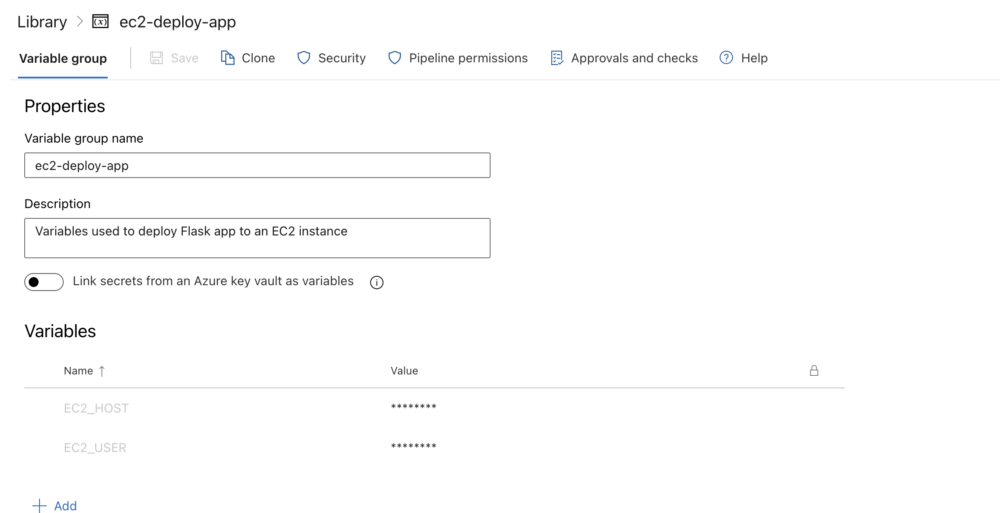
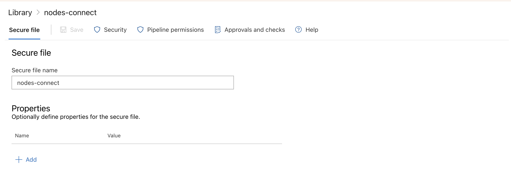

# CI/CD Pipeline

This project is configured with a CI/CD pipeline using Azure Pipelines, defined in the `ci-pipeline.yaml` file. The pipeline automates the building, testing, and deployment of the Flask application to an AWS EC2 instance.

## Prerequisites

Before running the pipeline, some setup is required in both AWS and Azure DevOps.

### AWS Setup

The pipeline requires an AWS EC2 instance to be running and accessible from the internet. This means the instance must:
- Be located in a VPC with a public subnet.
- Have a public IP address associated with it.
- Have a security group that allows SSH access (port 22) from the internet, so the pipeline can connect and deploy the application.

The `infra/` directory in this project contains Terraform code to provision this infrastructure.

### Azure DevOps Setup

1.  **Variable Group:**
    The pipeline uses a variable group named `ec2-deployment-vars`. This group must contain the following variables:
    -   `EC2_HOST`: The public IP address or DNS name of the EC2 instance.
    -   `EC2_USER`: The username for connecting to the EC2 instance (e.g., `ec2-user`, `ubuntu`).

    

2.  **Secure File:**
    The pipeline needs to connect to the EC2 instance using SSH with a private key. This key must be uploaded to the Azure DevOps "Secure files" library. The file must be named `nodes-connect`. The `DownloadSecureFile` task in the pipeline will then securely download this key to the agent.

    

## Pipeline Overview

The pipeline is divided into two main stages:

1.  **Build**: Builds and tests the Flask application.
2.  **Deploy**: Deploys the application to an AWS EC2 instance.

The pipeline is automatically triggered on every push to the `main` branch.

```yaml
trigger:
  - main

pool:
  vmImage: 'ubuntu-latest'
```
-   **Trigger**: The pipeline starts automatically whenever a commit is pushed to the `main` branch.
-   **Pool**: The pipeline jobs will run on a virtual machine hosted by Microsoft, using the latest Ubuntu image.

---

## Stages

### 1. Build Stage

**Display Name:** `Build and Test Flask App`

This stage is responsible for building the application and running unit tests.

**Jobs:**

-   **Build:**
    -   **Steps:**
        1.  **Set up Python:**
            ```yaml
            - task: UsePythonVersion@0
              inputs:
                versionSpec: '$(pythonVersion)'
                addToPath: true
            ```
            This task specifies the Python version to be used in the subsequent steps. The version is defined in a variable `pythonVersion`, which is set to `3.12`.

        2.  **Install dependencies:**
            ```yaml
            - script: |
                python -m pip install --upgrade pip
                pip install -r src/requirements.txt
              displayName: 'Install dependencies'
            ```
            This script first upgrades `pip` to the latest version and then installs all the necessary Python packages listed in the `src/requirements.txt` file.

        3.  **Run unit tests:**
            ```yaml
            - script: |
                python -m unittest src/test_hello_world.py
              displayName: 'Run unit tests'
            ```
            This script executes the unit tests located in `src/test_hello_world.py` to verify the application's functionality.

        4.  **Archive files:**
            ```yaml
            - task: ArchiveFiles@2
              displayName: 'Archive Flask app'
              inputs:
                rootFolderOrFile: '$(Build.SourcesDirectory)/src'
                includeRootFolder: false
                archiveType: 'zip'
                archiveFile: '$(Build.ArtifactStagingDirectory)/flask_app.zip'
                replaceExistingArchive: true
            ```
            This task packages all the files from the `src` directory into a single `.zip` file named `flask_app.zip`. This archive is stored in the `Build.ArtifactStagingDirectory`, a temporary location for artifacts.

        5.  **Publish artifact:**
            ```yaml
            - task: PublishBuildArtifacts@1
              displayName: 'Publish Artifact'
              inputs:
                PathtoPublish: '$(Build.ArtifactStagingDirectory)'
                ArtifactName: 'flask_app'
                publishLocation: 'Container'
            ```
            This task publishes the `flask_app.zip` file as a build artifact named `flask_app`. This makes the file available to other stages in the pipeline, such as the `Deploy` stage.

### 2. Deploy Stage

**Display Name:** `Deploy to AWS EC2`

This stage runs only if the `Build` stage is successful. It deploys the application to a pre-configured AWS EC2 instance.

**Jobs:**

-   **Deploy:**
    -   **Steps:**
        1.  **Download Build Artifacts:**
            ```yaml
            - task: DownloadBuildArtifacts@1
              inputs:
                buildType: 'current'
                downloadType: 'single'
                artifactName: 'flask_app'
                downloadPath: '$(System.ArtifactsDirectory)'
              displayName: 'Download Build Artifacts'
            ```
            This task downloads the `flask_app` artifact that was published during the `Build` stage.

        2.  **Download SSH Key:**
            ```yaml
            - task: DownloadSecureFile@1
              name: ec2SSHKey
              inputs:
                secureFile: 'nodes-connect'
              displayName: 'Download SSH Key'
            ```
            This task downloads a secure file named `nodes-connect` from the Azure DevOps library. This file is the private SSH key used to authenticate with the EC2 instance.

        3.  **Copy Flask App to EC2:**
            ```yaml
            - script: |
                chmod 400 $(ec2SSHKey.secureFilePath)
                scp -o StrictHostKeyChecking=no -i $(ec2SSHKey.secureFilePath) $(System.ArtifactsDirectory)/flask_app.zip $(EC2_USER)@$(EC2_HOST):/home/$(EC2_USER)/
              displayName: 'Copy Flask App to EC2 via SCP'
              env:
                EC2_USER: $(EC2_USER)
                EC2_HOST: $(EC2_HOST)
            ```
            This script performs two actions:
            -   `chmod 400`: It changes the permissions of the downloaded SSH key to be read-only for the owner, which is a requirement for SSH keys.
            -   `scp`: It securely copies the `flask_app.zip` file to the home directory of the specified user on the EC2 instance. The `EC2_USER` and `EC2_HOST` are variables defined in the `ec2-deployment-vars` variable group.

        4.  **Run the app:**
            ```yaml
            - script: |
                ssh -o StrictHostKeyChecking=no -i $(ec2SSHKey.secureFilePath) $(EC2_USER)@$(EC2_HOST) '
                  unzip -o /home/$(EC2_USER)/flask_app.zip -d /home/$(EC2_USER)/flask_app &&
                  cd /home/$(EC2_USER)/flask_app &&
                  python3 -m venv venv &&
                  source venv/bin/activate &&
                  pip install -r requirements.txt &&
                  pkill -f "python3 hello_world.py" || true
                  nohup python3 hello_world.py > /dev/null 2>&1 &
                '
              displayName: 'Run the app'
              env:
                EC2_USER: $(EC2_USER)
                EC2_HOST: $(EC2_HOST)
            ```
            This script connects to the EC2 instance via SSH and runs a series of commands to deploy and start the application:
            -   `unzip`: It unzips the `flask_app.zip` archive into a directory named `flask_app`.
            -   `python3 -m venv venv`: It creates a new Python virtual environment.
            -   `source venv/bin/activate`: It activates the virtual environment.
            -   `pip install`: It installs the application's dependencies.
            -   `pkill`: It stops any previously running instance of the application. The `|| true` part ensures that the script doesn't fail if no process is found.
            -   `nohup ... &`: It starts the Flask application in the background. `nohup` ensures that the process continues to run even after the SSH session is closed.
            
## Deployed Application

Once the pipeline is finished, the application will be running on the EC2 instance.

## Reflaction

This comprehensive exercise served as my introduction to Azure DevOps pipelines. It helped me bridge the gap between my previous CI/CD experience and ADO's specific implementation of stages, jobs, and predefined tasks. While the current pipeline is a conceptual model, it successfully validates the workflow logic. The next phase of this project will focus on integrating a dedicated infrastructure-as-code pipeline to automate the deployment of the underlying Flask application environment. 