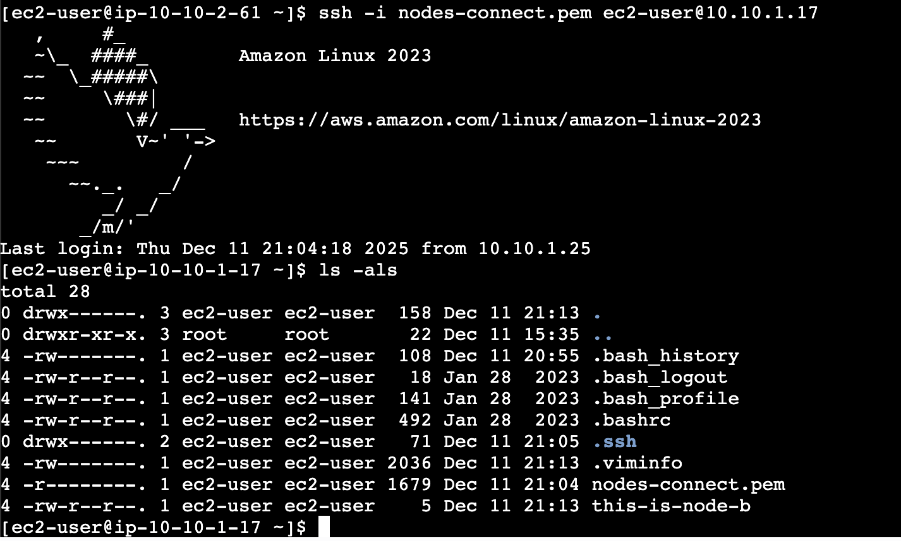
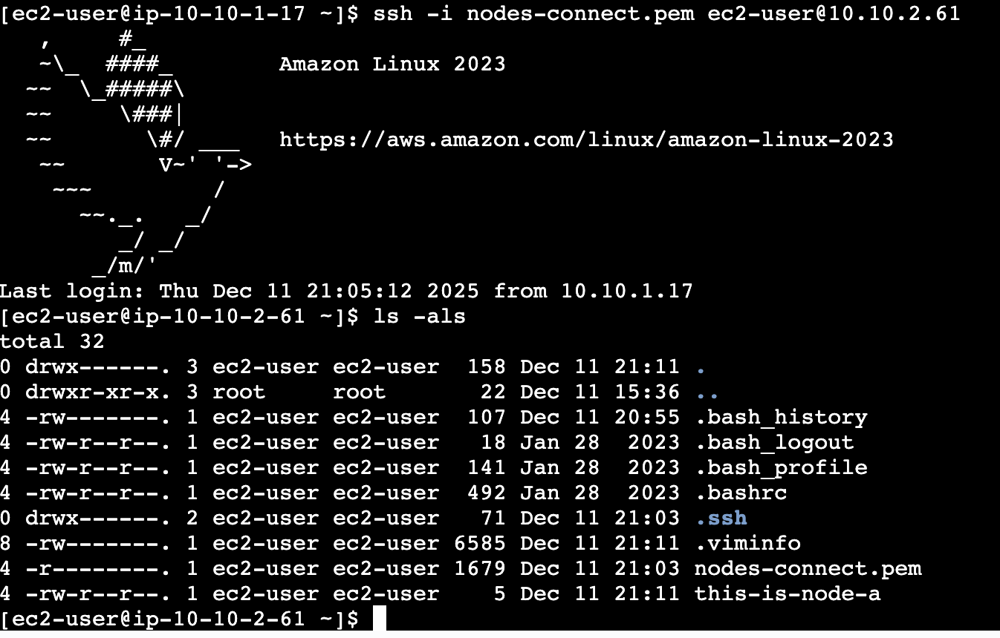
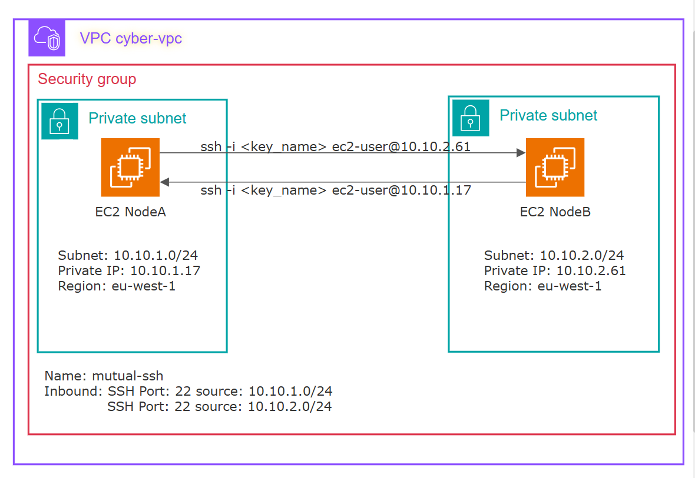

## SSH to EC2 instances

SSH from NodeA to NodeB

SSH from NodeB to NodeA

## Reflection

Creating the VPC, security groups, and EC2 instances through the AWS Console is straightforward. The only non-obvious part was configuring SSH access between the EC2 instances. Each instance required an SSH key pair to be generated and associated at creation. To enable SSH connectivity between the instances, I had to use the same key pair locally and distribute the public key across the instances.

For console-based access, I used EC2 Instance Connect. Because the instances were deployed in private subnets, I had to select the “Connect using a Private IP” option. This automatically created an EC2 Instance Connect Endpoint, allowing me to access each instance directly. From there, using the SSH key, I could establish connections between the instances internally.

At the end of the assignment I learned how to create related resources to be able to deploy a functional virtual machine in AWS

## Diagram

