# Docker
# Section 1: Core Concepts

### Q1.1

#### What is a docker container and how is different from a virtual machine?

A docker container is a lightweight, isolated runtime environment that packages an application togheter with its dependancies, libraries and configuration so it can run accross different systems. Containers share the host operationg system's kernel but remain isolated from each other using Linux kernel features such as namespaces (network, process, filesystem) and cgroups (resources like CPU, memory, etc).

Unlike virtual machines, containers do not include a full operating system. Multiple containers share the host OS hernel while remaining isolated from each other. A VM is also requiring more resources and are much slower than containers.

As an annalogy: VMs are like different buildings, each with its own foundation, and containers are like apartments in the same building, they share the same foundation but are isolated units.

### Q1.2

#### Match the Docker command to its function:

A. docker build -> build image from dockerfile
B. docker ps -> show running containers
C. docker run -> run a container

### Q1.3

#### Name three reasons why Docker is useful in modern DevOps pipelines.

1. Docker is used in modern CI/CD pipelies to guarantee that the same code runs everywhere (own machine, development environment, production, etc). So it makes bugs reproductible and deployments predictible.
2. Docker images are versioned, immutable unit of deployments which means that the content of them does not change, it can be tagged, stored and deployed across environments and makes rollbacks simple and reliable
3. Docker enables fast automation and scalability because containers are lightweight, start in seconds and can be created or destroyed programatically with minimal overhead. this fast startup and teardown allows pipelines to execute stages in parallel and on demand, significantly reducing feedback time. Containers can be horizontally scaled easily by running multiple instances (very useful when using orchestration tools like Kubernetes). The CI/CD Pipelines become faster and easier to automate ent-to-end.

# Section 2: Dockerfile and Image building

### Q2.1 Coding

#### Given a Python app with app.py and requirements.txt, write a basic Dockerfile to build and 
run it.

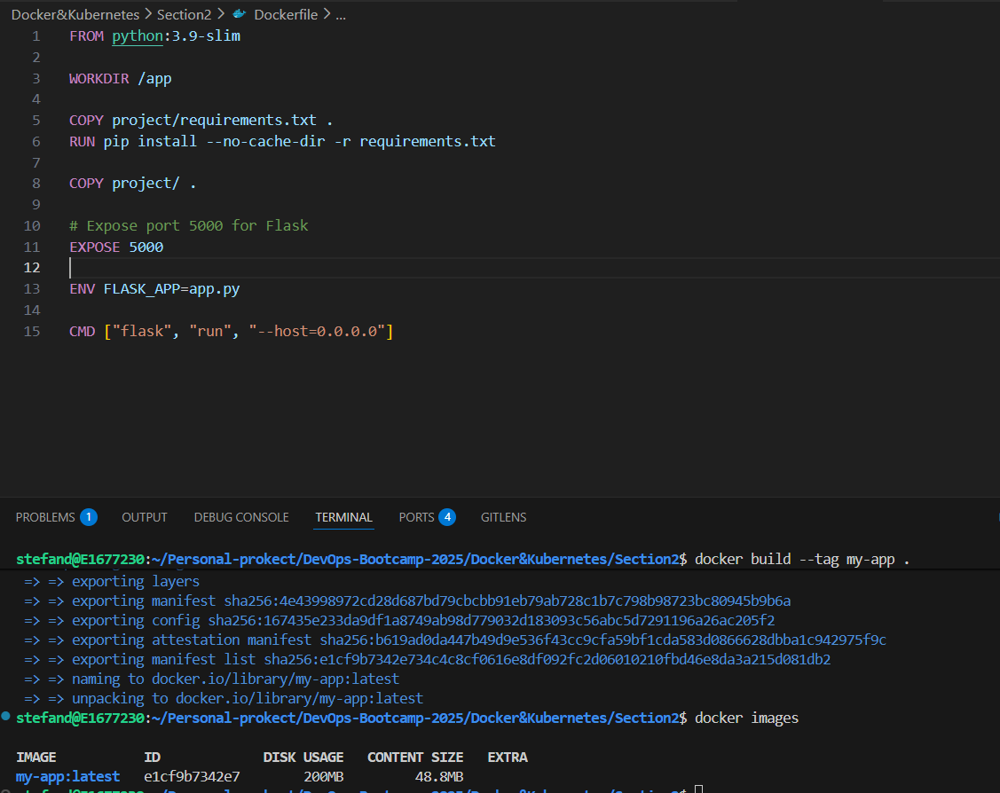

docker run -p 8080:5000 --name container1 my-app:latest

Access in browser http://127.0.0.1:8080/

### Q2.2 Coding

Modify the above Dockerfile to use a multi-stage build with no pip/build tools in final image.

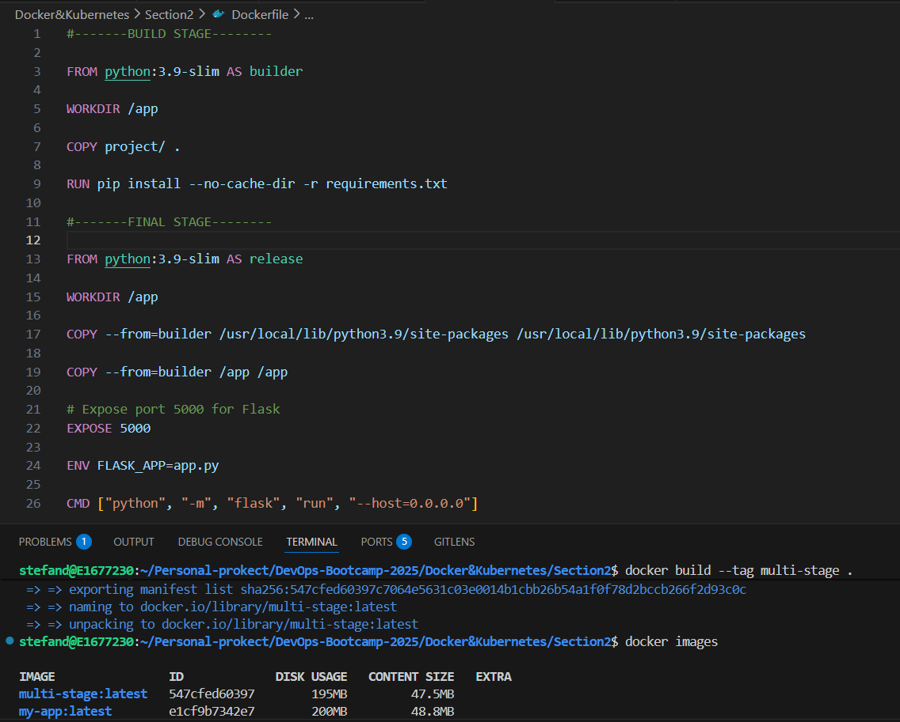

docker run -p 8080:5000 --name multi-stage multi-stage:latest

Access in browser http://127.0.0.1:8080/

### Q2.3 

#### Explain how Docker layer caching works and how it helps with CI/CD pipelines.

Docker layer caching works by breaking the image build process into multiple steps, called layers and saving the result of each step. When CI/CD pipeline runs, Docker checks whether a layer can be reused or needs to be rebuild based on what has changes. If only the application code changes, Docker reuses each earliers layers such as the base image and installed dependancies and rebuilds only the final layers. This avoids repeating steps like downloading packages ot installing dependancies. As a result, image builds are much faster, fewer resources are used and CI/CD pipeline are more efficent and reliable.

In a Dockerfile each instruction creates a read-only layer. The order is very important for the building logic.

# Section 3: Docker Networking, Volumes, and Compose

### Q3.1

#### Write a docker-compose.yml file for a Python web app and a Redis container.

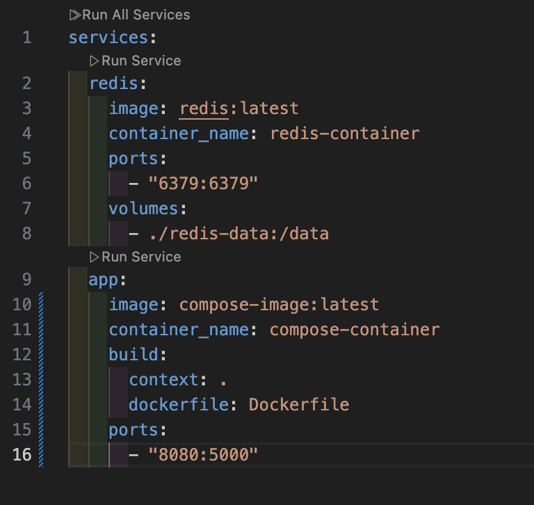

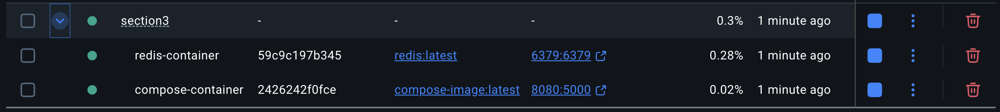

### Q3.2

#### In what scenario would you use Docker Compose instead of running containers manually?

Docker Compose is ideal for defining and running multi-container applications. Instead of running services manually with complex `docker run` commands, you define the entire stack (containers, networks, volumes) in a single `docker-compose.yml` file. This ensures reproducibility across environments, simplifies orchestration (starting/stopping the whole stack with one command), and automatically handles networking between services.

### Q3.3 - Multiple Choice

#### Which of the following are benefits of using volumes in Docker?

A. Data persists after container deletion
B. Can be backed up
C. Consume less memory
D. Can be shared between containers

**Correct Answers: A, B, D**

# Section 4: Challenge

#### You are given a Node.js app that connects to PostgreSQL. Write a docker-compose.yaml and explain how to use .env for DB_USER, DB_PASS and DB_NAME. Add suggestive comments to understand the role of each component used in docker-compose.yaml.

#### Note: View Docker compose file and .env file in Section4 folder

# Kubernetes

### 1. Kubernetes Core Components

**Explain what a Pod is**: A pod is the smallest deployeable and scheduleable unit in Kubernetes. It can have a single container or multiple containers (such as init containers, sidecar containers, etc). The containers inside a pod share storage and network resources. Kubernetes is not managing directly containers, its managing Pods. Pods are ephemeral and are usually managed by controllers like Deployments, statefulsets, deamonsets or jobs.

**What is the role of the kubelet on a worker node**: the kubelet role is to ensure that containers defined in pods actually run and stay running on the worker node. It manages the pod lifecycle, receives the pod specificatio from API server, is ensuring that the containers in the pod are running and healthy and create/delete/restarts the containers as needed. The kubelet is an agent that enforces Pod specs, manages containers, monitor health and keeps the worker node in sync with the Kubernetes cluster.

**List 3 main components of the kubernetes control plane and their purpose**:
- kube-apiserver: The core component server that exposes the Kubernetes API
- etcd: The persistant key-value store for cluster state. Stores all cluster data (state) - pods, nodes, secrets, configmaps
- kube-scheduler: decides which node a Pod should run on. Evaluates the new Pods based on the resources need and schedule them on   the nodes that can satisfy the requirements

### 2. Working with pods and deployments

File: k8s/nginx-deployment.yaml

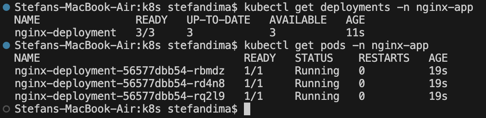

updating the deployment YAML with the latest image version will trigger a Rolling Upgrade on deployment, meaning that new pods will be created with the new image version, only when the new pods are created and containers are healthy the older pods will be deleted. This Upgate strategy is replacing older pods with newer pods one by one

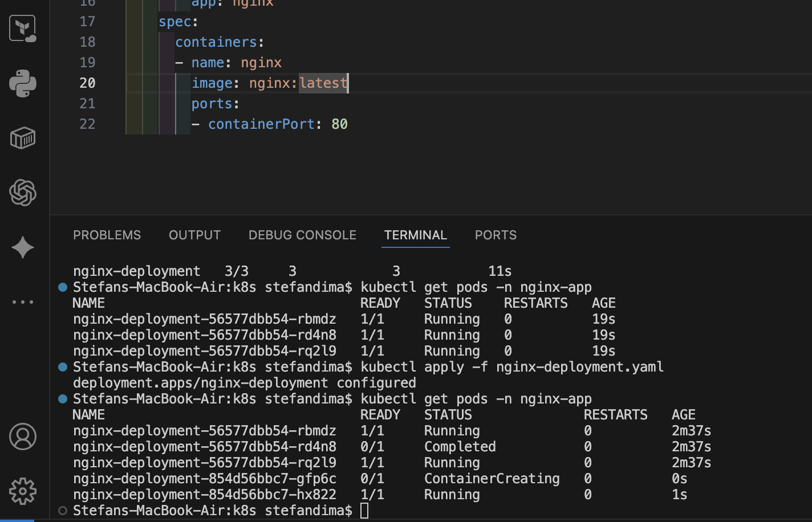

### 3. Kubernetes Services & Networking

File k8s/nginx-service.yaml

In a service definition file what is the most important is the **selector**, it has to point correctly to the Pods with the same label.

Port: 80 -> service is available internally on port 80
TargetPort: 80 -> points to the containerPort set on the pods
Type: ClusterIP -> it means that the service will be only exposed internally on the cluster (will assign an internal IP)

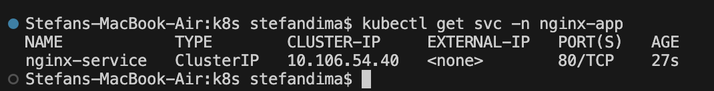

**Explain how kube-proxy helps with service networking**: the kube-proxy is a network agent that runs on each node and watches for new Services and Endpoints (Pods) and writes the routing rules on each node so when a service is accessed the traffic is routed to the correct pods.

**What is the role of DNS in Kubernetes networking**: DNS stands for Domain Name Sysyem and it basically translates the IP addresses to names foe ease of use. The same idea is in the Kubernetes scenario. DNS allows Pods to find each other using juman-redeable names instead of IP addresses (an IP address is temporary, if the pods is recreated it will have a new IP address). In Kubernetes, every service resource gets a FQDN (Fully Qualified Domain Name) following the strcuture [service-name].[namespace].svc.cluster.local. Having thins FQDN a pod from a namespace can reach a service from another namespace by using the actual DNS name not the IP address.

**Deploy a second service using NodePort**

NodePort: exposes the service on each node's IP at a static port. Used for exposing the service outside the cluster when a loadbalancer is not used (recommanded for testing purposes)

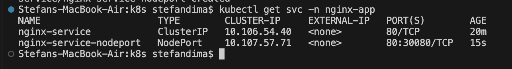

### 4. Helm Basics

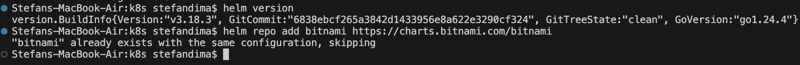

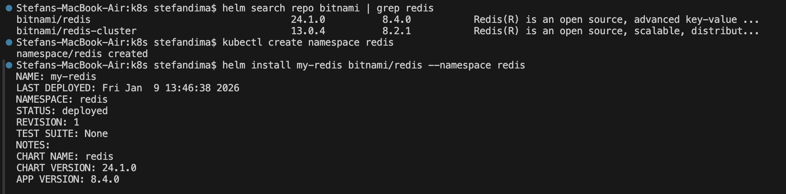

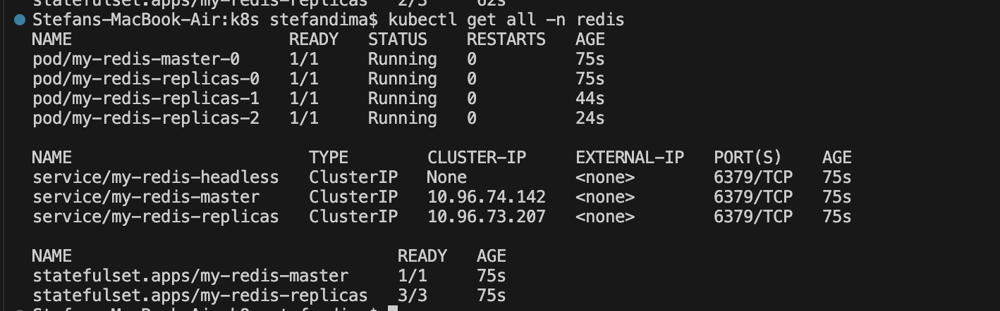

**What is the function of values.yaml in Helm**: values.yaml serves a default configuration for the chart. It defines all the configurable parameters that the chart templates can use when rendaring Kubernetes manifests.

### 5. Horizontal Pod Autoscaler

**Enable the metrics-server on minikube cluster** Using the command **minikube addons enable metrics-server** the metrics-server will be enabled on the cluster

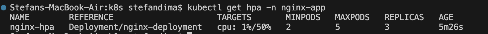

**Simulate load test**: the most simple way to simulate load to test if the HPA works is to connect to a nginx pod and to run **while true; do:; done** this is an infinite shell loop that will cause an increase of CPU utilization

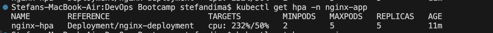

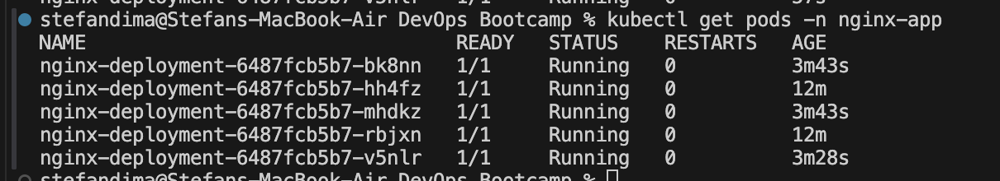

### 6. Monitoring and Debugging

To fail a pod I will use a bad Image name that will cause an ErrImagePull (image: nginx:badlatest)

This error is straightforward and it says that is something wrong with the image name (or a problem with the image registry)

using **kubectl descripe pod <pod_name> -n <namespace>** we can see the error described in the events section

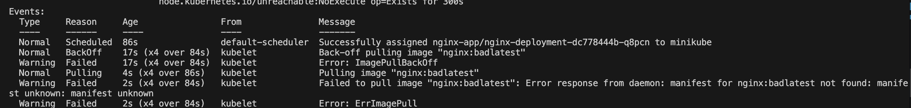

using **kubectl logs <pod_name> -n <namespace>** we can see the same error 

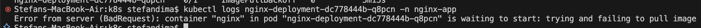

A pod can fail due to multiple factors. In this case it was due to a bad image used for the containers, but it can also fail because the app in the container is failling. It can also fail due to bad environment variables that the container is expecting to receive at runtime and for some reason they are missing, or a bad mount of a secret or a config map. The CrashLoopBackOff error is the most common error and it masks multiple reasons of failing, that is why it needs a more sustained troubleshooting.

### 7. EKS and IAM integrarion

**Explain the difference between managed node groups and Fargate profiles in EKS**

In Amazon EKS, managed node groups and Fargate profiles both run workloads but differ in infrastructure management and flexibility. 
**Managed node groups** provision EC2 instances as worker nodes, giving you control over instance types, scaling, and OS-level configuration, but requiring management of nodes, updates, and capacity. 
**Fargate profiles** run pods serverlessly without exposing or managing EC2 instances; you define which pods run on Fargate via selectors, and AWS handles provisioning, scaling, and patching automatically. 

Essentially, managed node groups offer more control and customization, while Fargate provides simplicity and operational abstraction.

### 8. Challenge

Created docker image with Dockerfile, test if everything works with docker compose

Tag the local image with the command: 
**docker tag challenge-app stefandima1407/docker-learning:1.0.0**

Push the image to personal registry:

**docker push stefandima1407/docker-learning:1.0.0**

Written all the templates to build a helm chart. Test the rendered manifests with the values from values.yaml with this command resulting a file with rendered manifests

**helm template my-2tier-app . > rendered.yaml**

Install helm chart

**cd k8s/challenge/flaskapp**
**helm install my-app . --namespace my-app --create-namespace**

The service for the frontend app has type of NodePort which means that the service will be available outside of the cluster. To expose it and access the service from browser we will use the minikube command **minikube service -n my-app --url my-app-frontend-service** that will map an node port to the application, then access the URL given in the response

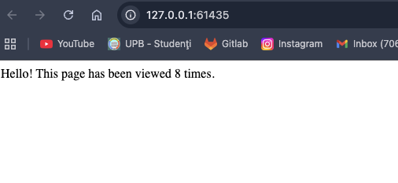