# Neonews Web App

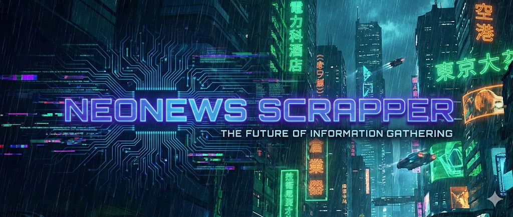

The evolution of Neonews CLI for fetching the latest news from various countries and topics, and archiving them to AWS (NOW WITH WEB APP)

## Overview

This application allows users to select a country and a news topic. It then fetches relevant news articles from the [Newsdata.io](https://newsdata.io/) API and country information from [REST Countries](https://restcountries.com/). The fetched articles are then saved to an AWS DynamoDB table, and the full JSON content is stored in an S3 bucket.

The web application has one initial form where the user has to type the country of his interest, the topic and the language of the fetch news

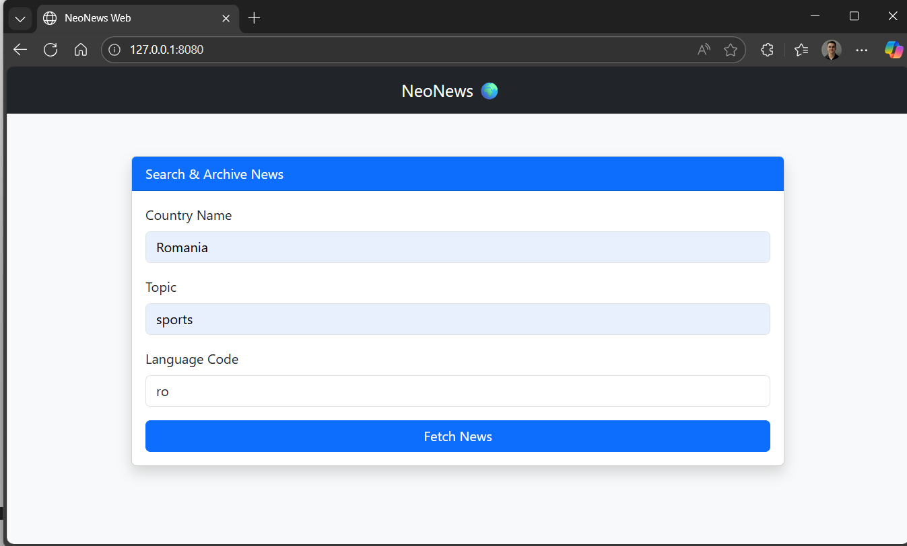

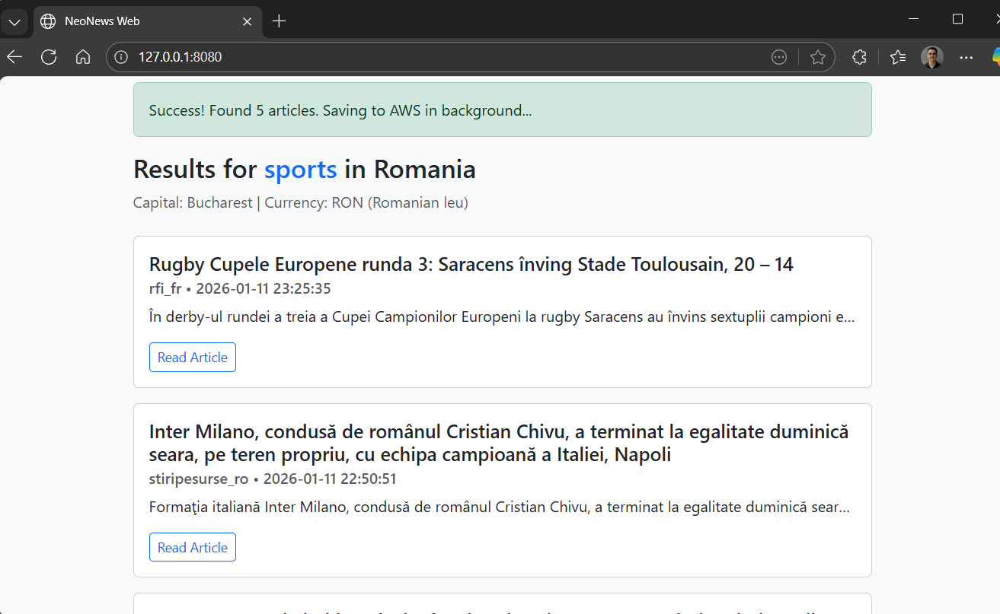

## Project structure

Here is a breakdown of the project's file structure and the purpose of each directory:

### **`docker/`**
This directory contains the docker-compose file that allows to test the application on the local machine before deploying on AWS Cloud. It is useful to use in order to identify issues and fix them before building the final image to deploy

### **`pipelines`**
This directory contains the CI/CD pipelines definition for Azure DevOps in order to deploy the application on an EC2 instance in AWS
**infra-deployment.yml**: The Pipeline that creates the infrastructure for the application. The infrastracture is created with Terraform and all the configuration can be found in **terraform/** directory.
**code-build**: The pipeline that tests the code using tools for linting and unit tests, then builds the docker image, scans the image for vulnerabilities with Trivy and finaly deploys and runs the application on an EC2 instance.

### **`src\`**
This directory contains the core logic of the application

### **`tests\`** 
This directory contains the unit tests for the application

### **`Dockerfile\`**
The Instructions used to create the docker image of the application

## File Structure of the application

Here is a breakdown of the files located in the `src/` directory and their specific responsibilities:

### **`src/api.py`**
This file is responsible for all external API interactions required by the application.
*   **Key Component:** Defines the `ApiClient` class.
*   **Functionality:**
    *   Connects to the **REST Countries API** to retrieve specific country information.
    *   Connects to the **Newsdata.io API** to fetch the latest news articles based on the user's selected topic and country.
    *   Acts as the data ingestion layer for the application.

### **`src/config.py`**
This file manages the configuration settings and environment variables for the application.
*   **Functionality:**
    *   Loads sensitive information and configuration parameters from the `.env` file.
    *   Exposes variables such as `NEWSDATA_API_KEY`, `AWS_REGION`, `DYNAMODB_TABLE`, and `S3_BUCKET_NAME` to the rest of the application.
    *   Ensures that the application has the necessary credentials and settings to run securely.

### **`src/aws_handler.py`**
This file encapsulates all logic related to Amazon Web Services (AWS) interactions.
*   **Key Component:** Defines the `AWSClient` class.
*   **Functionality:**
    *   Manages connections to **DynamoDB** for storing structured article metadata.
    *   Manages connections to **Amazon S3** for archiving the full raw JSON content of the news fetches.
    *   Handles the creation and deletion of these cloud resources programmatically.

### Architecture design

# Neonews Infrastructure

This Terraform configuration provisions the AWS infrastructure required for the Neonews application.

## Resources Created

### Networking
- **VPC (`neonews-vpc`)**: The Virtual Private Cloud that isolates the network resources.
- **Internet Gateway**: Attached to the VPC to enable internet access.
- **Subnet (`neonews-subnet-a`)**: A public subnet configured to automatically assign public IP addresses to instances launched within it.
- **Route Table**: A public route table associated with the subnet, directing internet-bound traffic (`0.0.0.0/0`) to the Internet Gateway.

### Security
- **Security Group**: A firewall configuration applied to the instance allowing:
  - **Inbound**: SSH (port 22), HTTP (port 80), and Application traffic (port 8080) from any IP (`0.0.0.0/0`).
  - **Outbound**: All traffic allowed.
- **Key Pair (`nodes-connect`)**: Uploads the local public key (`nodes-connect.pub`) to AWS to enable SSH authentication.

### Identity & Access Management (IAM)
- **IAM Role (`EC2-ECR-Pull-Role`)**: An IAM role assumed by the EC2 instance to interact with AWS services.
- **Attached Policies**:
  - `AmazonDynamoDBFullAccess`: Full access to DynamoDB tables.
  - `AmazonEC2ContainerRegistryReadOnly`: Permission to pull Docker images from ECR.
  - `AmazonS3FullAccess`: Full access to S3 buckets.
  - `CloudWatchFullAccess`: Permission to write logs and metrics to CloudWatch.
  - `AmazonSSMFullAccess`: Permission to be managed by AWS Systems Manager.
- **Instance Profile**: Links the IAM role to the EC2 instance.

### Compute
- **EC2 Instance (`NodeA`)**: A virtual machine launched in the public subnet using the specified AMI and instance type. It is configured with the security group, key pair, and IAM instance profile defined above.
- **EC2 Instance Connect Endpoint**: A resource that enables secure SSH connections to the instance using EC2 Instance Connect.

#### Infrastracture Architecture Diagram 

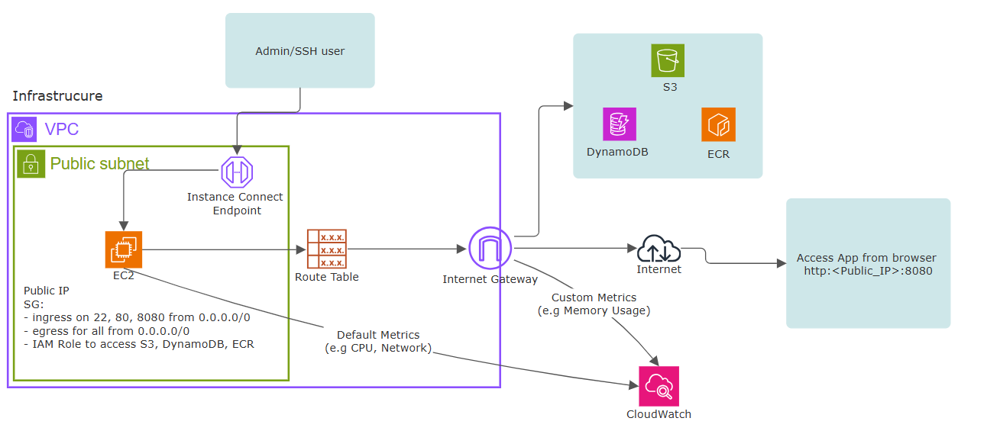

### CI/CD Workflow

To automate the infrastructure provision and application build and deployment, two pipelies were configured in Azure DevOps. The pipelies are configured to use a variable group called **aws-ecr** that contains the variables required to authenticate in the AWS Cloud and related resources. 

#### CI/CD workflow Diagram 

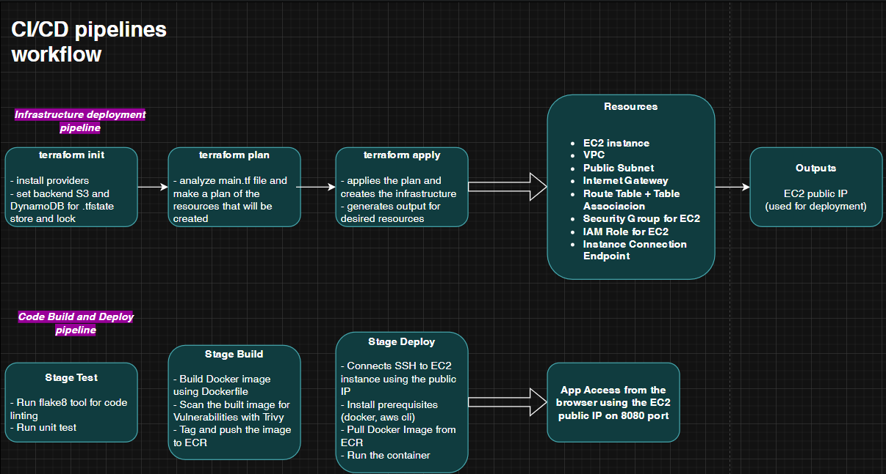

The deployment process is made in two steps. First run the infra-deployment.yml from **pipelines/** to create the all underlying infrastrcuture that creates an EC2 instance that has a public IP address. The second step is running the code-build.yml pipeline that is the actual building docker image of the application, test the code and push the image to a container registry (in this case was used the ECR solution from AWS)

When the infra-deployment pipeline runs, after the terraform apply the pipeline stores the ec2_public_ip in a variable called EC2_HOST which will be saved in the same variable group (aws-ecr) to use it in the code-deployment.yml pipeline. 

#### Example output of the infrastructure pipeline
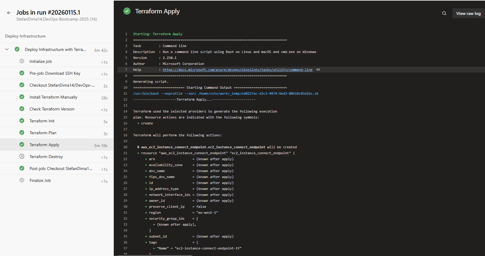

The code-build pipeline is triggered manually. At each run will test the code, build the docker image, scan the image for vulnerabilities and deploy the image to ECR then pulled the image on EC2 and run the application. To connect remotely to the EC2 via SSH, the private key is stored as secure file in Library and Downloaded when needed in the pipeline. The image built is tagged with a tag starting from 1.0.x and each build will increment the value of the tag. 

In the ECR the images are looking like this: 

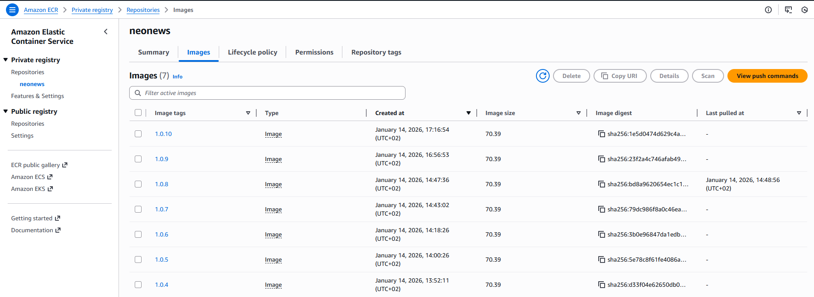

The application is using two S3 buckets, one to store the .tfstate files in order to have a backup of the infrastracture, and another one that stores the content fetch by the web application (news selected by the user). The DynamoDB is used for terraform state locks to prevent ovverides on the terraform states and also a table for the application that stores information about the news fetched based on the selected criteria (in the web interface the information is displayed based on this DynamoDB table). 

#### S3 buckets

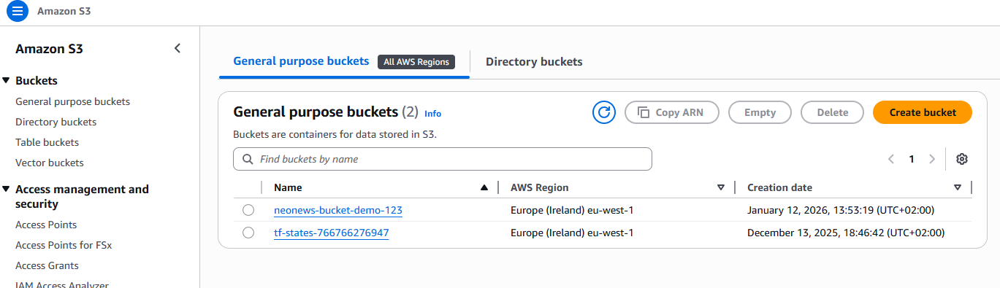

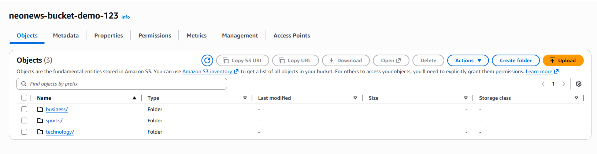

#### DynamoDB

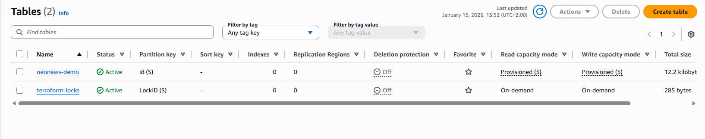

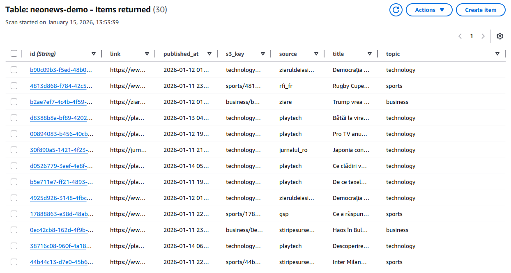
