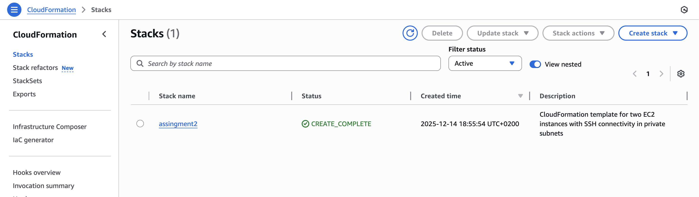
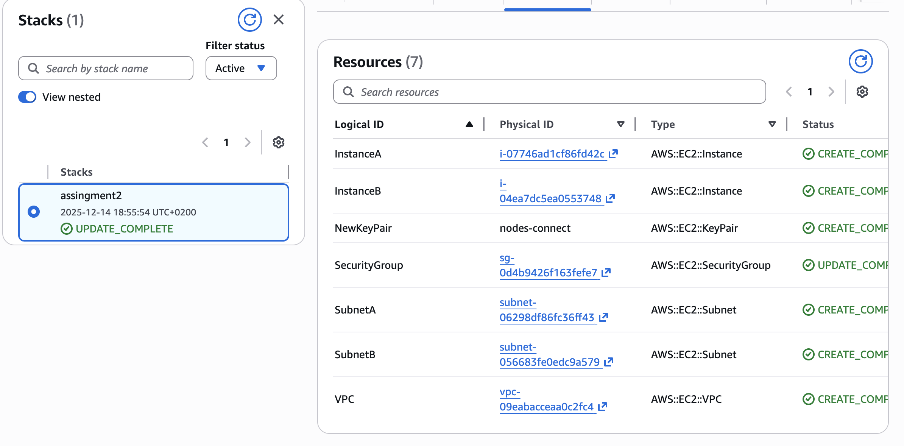
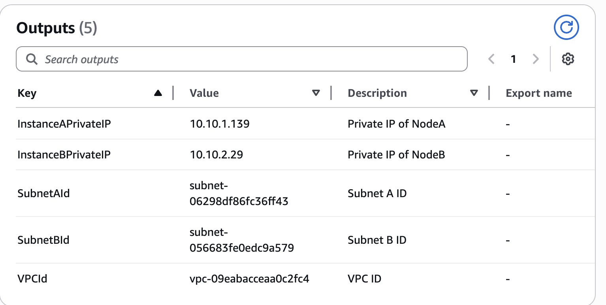
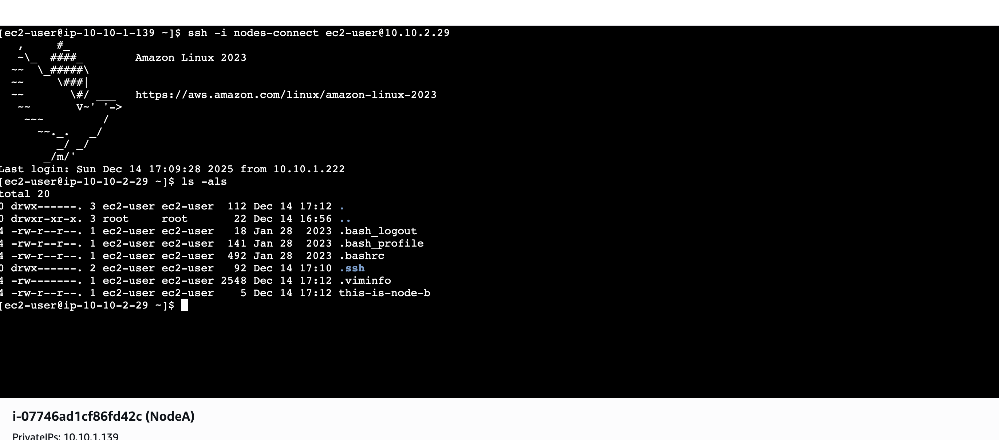
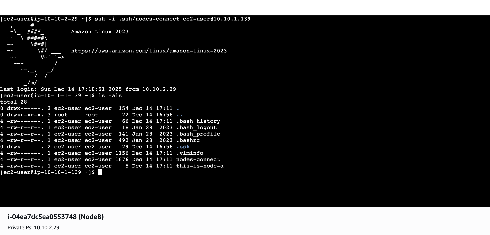

## Prerequisites

To run the AWS CLI command for CloudFormation, you must assign the following roles to the CLI user you are using: `CloudFormationFullAccess` and `AmazonSSMFullAccess`.

Other permission policies attached to the user to complete the assignment exercises:

- AmazonDynamoDBFullAccess
- AmazonEC2FullAccess
- AmazonS3FullAccess
- AmazonVPCFullAccess

## Instructions

AWS CloudFormation is an infrastructure-as-code (IaC) service that lets you define, provision, and manage AWS resources using declarative templates (YAML or JSON).

The infrastructure described in `/cloudformation/main.yaml` will be created with CloudFormation.

The infrastructure created has:

- **EC2 Key Pair (`NewKeyPair`)**: Creates an EC2 key pair named `nodes-connect` to enable SSH access to the instances. The private key must be downloaded and used for SSH connections.

- **VPC (`VPC`)**: Provisions a Virtual Private Cloud with the CIDR block `10.10.0.0/16`, DNS support, and DNS hostnames enabled. This provides an isolated network for the resources.

- **SubnetA (`SubnetA`)**: Creates a private subnet in Availability Zone `eu-west-1a` with the CIDR block `10.10.1.0/24` for hosting one of the EC2 instances.

- **SubnetB (`SubnetB`)**: Creates a private subnet in Availability Zone `eu-west-1b` with the CIDR block `10.10.2.0/24` for hosting the second EC2 instance.

- **Security Group (`SecurityGroup`)**: Defines a security group named `mutual-ssh` that allows inbound SSH (port 22) traffic only from the two private subnets, enabling secure SSH connectivity between the instances. Outbound traffic is allowed to anywhere.

- **EC2 Instance A (`InstanceA`)**: Launches an EC2 instance in SubnetA, using the specified instance type and the created key pair. The instance is tagged as `NodeA` and is associated with the security group for SSH access.

- **EC2 Instance B (`InstanceB`)**: Launches an EC2 instance in SubnetB, using the specified instance type and the created key pair. The instance is tagged as `NodeB` and is associated with the security group for SSH access.

- **Outputs**: The template outputs the IDs of the VPC, both subnets, and the private IP addresses of both EC2 instances for reference after stack creation.

Run the command below to create the CloudFormation stack:

```sh
aws cloudformation deploy --template-file main.yaml --stack-name assignment2 --region eu-west-1
```

Expected output:

```
Waiting for changeset to be created..
Waiting for stack create/update to complete
Successfully created/updated stack - assignment2
```



The resources created are shown in the AWS Console:



The outputs declared in the `main.yaml` file are displayed in the output section of the CloudFormation stack:



From this output, the private IPs for each instance can be used to connect via SSH.

To retrieve the SSH private key in order to connect via SSH between the instances, use the commands below:

```sh
aws ec2 describe-key-pairs --filters Name=key-name,Values=nodes-connect --query 'KeyPairs[*].KeyPairId' --output text
```
This command will display the key pair ID created with CloudFormation.

```sh
aws ssm get-parameter --name /ec2/keypair/key-015be13d981137af6 --with-decryption --query Parameter.Value --output text > nodes-connect.pem
```
This will retrieve the private key, which must be copied to each instance to perform SSH connections between them.

After all resources are created, you can connect to each instance using the EC2 Instance Connect option from the AWS Console with the Private IP option. Because this is the first time connecting to the instances, you must create an EC2 Instance Connect Endpoint. After the endpoint is created, you can connect to each instance.

**Connection from NodeA to NodeB:**



**Connection from NodeB to NodeA:**



## CloudFormation vs Terraform

CloudFormation is tightly integrated with AWS services and works natively within the AWS ecosystem. It uses YAML or JSON templates, which makes it easier to adopt for users who are already familiar with these formats and do not want to learn a new language.

Terraform, on the other hand, uses its own language called HCL. While this requires time to learn, it provides clearer structure and stronger abstraction capabilities, especially for complex infrastructures.

A key advantage of Terraform is its versatility. It is not limited to AWS and can manage resources across multiple cloud providers and platforms, making it a better choice for multi-cloud or hybrid environments.

On the other hand, if the infrastructure is strongly related to AWS services, CloudFormation could be a better solution.
