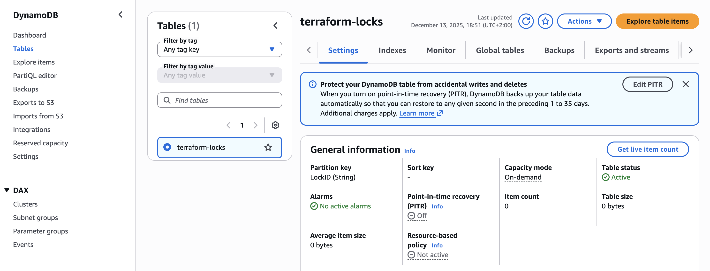
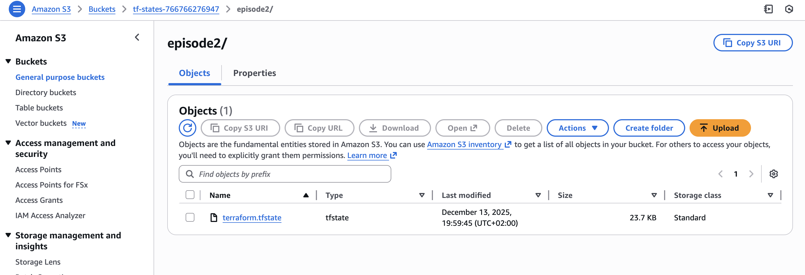
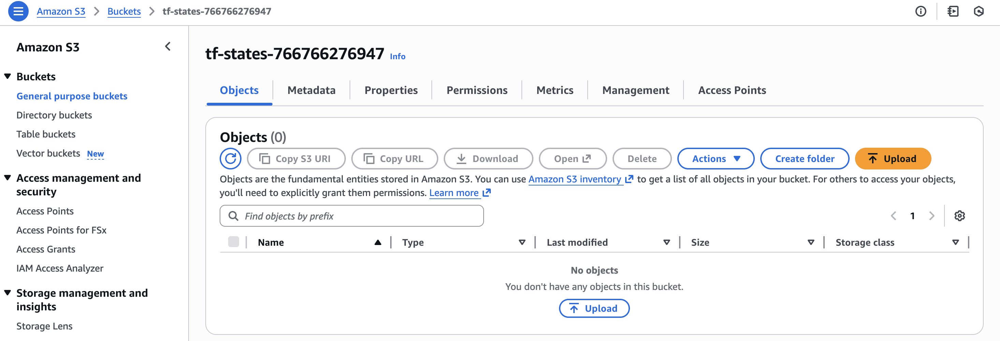
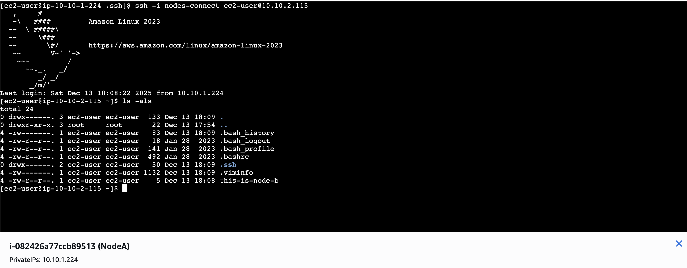
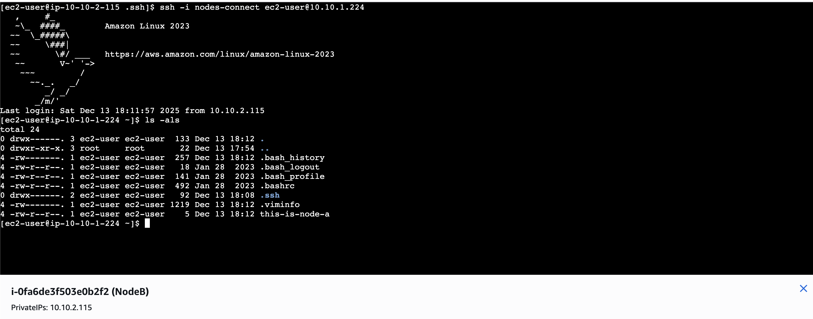

## Prerequisites

These permission policies should be attached to your user to complete the assignment exercises:

- AmazonDynamoDBFullAccess
- AmazonEC2FullAccess
- AmazonS3FullAccess
- AmazonVPCFullAccess

## File Structure

- The `providers.tf` file describes the providers used by Terraform to create the infrastructure (AWS provider).

- The `backend.tf` file describes the S3 bucket used to store the Terraform state files for this infrastructure. It also uses a DynamoDB table to lock the state (a safety check that prevents overwriting the state when multiple users run `terraform apply` simultaneously).

- The `outputs.tf` file describes what Terraform should display in the terminal after the `terraform apply` command.

- The `variables.tf` file defines the variables used in the Terraform files to allow for a parameterized structure.

- The infrastructure is described in the `main.tf` file and includes:

  - **EC2 Key Pair (`aws_key_pair`)**: Creates an EC2 key pair named `nodes-connect` using a locally generated public key (`nodes_connect.pub`). The private key must be used for SSH connections between the instances.

  - **VPC**: Provisions a Virtual Private Cloud with the CIDR block `10.10.0.0/16`, DNS support, and DNS hostnames enabled. This provides an isolated network for the resources.

  - **SubnetA**: Creates a private subnet in Availability Zone `eu-west-1a` with the CIDR block `10.10.1.0/24` for hosting one of the EC2 instances.

  - **SubnetB**: Creates a private subnet in Availability Zone `eu-west-1b` with the CIDR block `10.10.2.0/24` for hosting the second EC2 instance.

  - **Security Group**: Defines a security group named `mutual-ssh` that allows inbound SSH (port 22) traffic only from the two private subnets, enabling secure SSH connectivity between the instances. Outbound traffic is allowed to anywhere.

  - **EC2 Instance A**: Launches an EC2 instance in SubnetA, using the specified instance type and the created key pair. The instance is tagged as `NodeA` and is associated with the security group for SSH access.

  - **EC2 Instance B**: Launches an EC2 instance in SubnetB, using the specified instance type and the created key pair. The instance is tagged as `NodeB` and is associated with the security group for SSH access.

  - **Outputs**: The configuration outputs the IDs of the VPC, both subnets, and the private IP addresses of both EC2 instances for reference after creation.

### Deploying the Infrastructure

1. **Initialize Terraform and configure the backend:**
   - Ensure your `backend.tf` is configured for S3 and DynamoDB state locking.
   - Before running Terraform commands, create the S3 bucket and DynamoDB table:
   ```sh
   aws dynamodb create-table --table-name terraform-locks --attribute-definitions AttributeName=LockID,AttributeType=S --key-schema AttributeName=LockID,KeyType=HASH --billing-mode PAY_PER_REQUEST --region eu-west-1
   ```

   Sample output:
   ```json
   {
       "TableDescription": {
           "AttributeDefinitions": [
               {
                   "AttributeName": "LockID",
                   "AttributeType": "S"
               }
           ],
           "TableName": "terraform-locks",
           "KeySchema": [
               {
                   "AttributeName": "LockID",
                   "KeyType": "HASH"
               }
           ],
           "TableStatus": "CREATING",
           "CreationDateTime": "2025-12-13T18:49:33.036000+02:00",
           "ProvisionedThroughput": {
               "NumberOfDecreasesToday": 0,
               "ReadCapacityUnits": 0,
               "WriteCapacityUnits": 0
           },
           "TableSizeBytes": 0,
           "ItemCount": 0,
           "TableArn": "arn:aws:dynamodb:eu-west-1:xxxxxx:table/terraform-locks",
           "TableId": "xxxxxxxxx",
           "BillingModeSummary": {
               "BillingMode": "PAY_PER_REQUEST"
           }
       }
   }
   ```

   This table is referenced in the Terraform backend configuration to enable state locking.

   - **DynamoDB Table:** Used for Terraform state locking to prevent concurrent modifications to the state file.
     
   - **S3 Bucket for Terraform State:** Stores the Terraform state file remotely, enabling collaboration and state recovery.
     
   - **S3 Bucket (UI):** S3 bucket as seen in the AWS Console, confirming its creation.
     

   **NOTE:** Create an SSH key on your local computer and copy the public key to the root directory of the Terraform project. Add it to your `.gitignore` file to avoid including it when pushing to Git!

   ```sh
   ssh-keygen -t rsa -b 4096 -f nodes-connect
   ```

   After generating the SSH key pair, you need to configure the key pair in Terraform:

   ```hcl
   resource "aws_key_pair" "nodes_connect" {
     key_name   = var.key_pair_name
     public_key = file("${path.module}/nodes_connect.pub")
   }
   ```

   This resource uploads the public key (`nodes_connect.pub`) to AWS and associates it with the EC2 instances. The private key (`nodes-connect`) remains on your local machine. To enable SSH connections between the EC2 instances, you must manually copy the private key to each instance after they are created. This allows the instances to authenticate with each other using SSH.

   - Run:
     ```sh
     terraform init
     ```
2. **Review the plan:**
     ```sh
     terraform plan
     ```
3. **Apply the configuration:**
     ```sh
     terraform apply
     ```
   - Confirm the apply when prompted.

   Expected output:
   ```
   Apply complete! Resources: X added, 0 changed, 0 destroyed.

   Outputs:
   instance_a_private_ip = "10.10.1.X"
   instance_b_private_ip = "10.10.2.X"
   vpc_id = "vpc-xxxxxxx"
   subnet_a_id = "subnet-xxxxxxx"
   subnet_b_id = "subnet-yyyyyyy"
   ```

After all resources are created, you can connect to each instance using the EC2 Instance Connect option from the AWS Console with the Private IP option. Because this is the first time connecting to the instances, you must create an EC2 Instance Connect Endpoint. After the endpoint is created, you can connect to each instance.

- **SSH from Node A to Node B:** Demonstrates a successful SSH connection from one EC2 instance to another using the private key.
  
- **SSH from Node B to Node A:** Shows SSH connectivity in the reverse direction, confirming bidirectional access.
  


### Why use DynamoDB for Terraform state locking?

When using Terraform in a team or with remote state, it is important to prevent multiple people or processes from making changes to the infrastructure at the same time. DynamoDB is used for state locking, which ensures that only one Terraform process can modify the state at a time, preventing conflicts and potential corruption of the state file.
