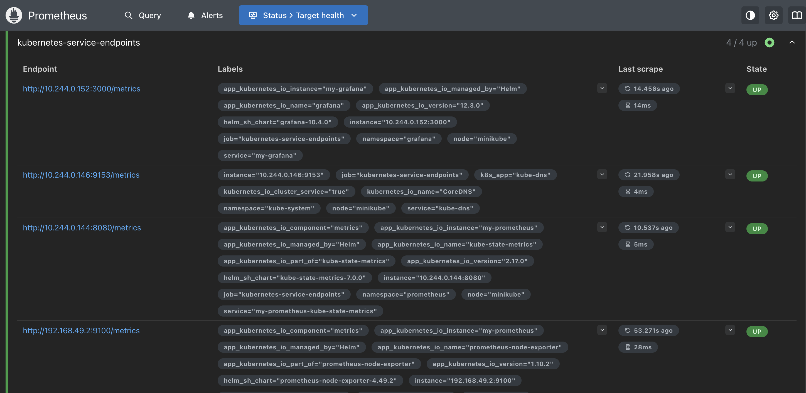
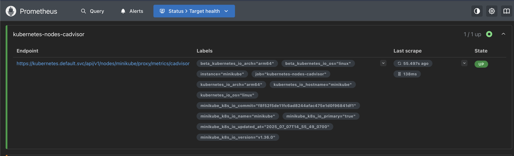

# Monitoring with Prometheus and Grafana on Kubernetes

This guide details how to set up a monitoring stack on a local Kubernetes cluster using Minikube. The stack includes Prometheus for metrics collection and Grafana for visualization.

## Overview

The main objectives of this setup are:
- Create a local Kubernetes cluster using Minikube.
- Install Prometheus and Grafana using Helm charts.
- Expose the services using `kubectl port-forward` to access them in a web browser.
- Scrape metrics from Kubernetes nodes using **Node Exporter** and container metrics using **cAdvisor**.

## Prerequisites

Before you begin, ensure you have the following tools installed:
- [Docker](https://docs.docker.com/get-docker/)
- [Minikube](https://minikube.sigs.k8s.io/docs/start/)
- [Helm](https://helm.sh/docs/intro/install/)

---

## Installation Steps

### 1. Install Prometheus

First, we'll create a dedicated namespace and install Prometheus using the official Helm chart.

```bash
# Create a namespace for Prometheus
kubectl create namespace prometheus

# Install Prometheus from the community Helm repository
helm install my-prometheus oci://ghcr.io/prometheus-community/charts/prometheus -n prometheus -f Prometheus/values.yaml
```

### 2. Install Grafana

Next, we'll set up Grafana in its own namespace.

```bash
# Create a namespace for Grafana
kubectl create namespace grafana

# Add the Grafana Helm repository
helm repo add grafana https://grafana.github.io/helm-charts
helm repo update

# Install Grafana using the Helm chart
helm install my-grafana grafana/grafana -n grafana -f Grafana/values.yaml
```

---

## Accessing the Services

To access the Prometheus and Grafana dashboards, you'll need to forward their ports to your local machine.

### Accessing Prometheus

The Prometheus server can be accessed on port `9090`.

```bash
# Get the Prometheus pod name
export PROMETHEUS_POD_NAME=$(kubectl get pods --namespace prometheus -l "app.kubernetes.io/name=prometheus,app.kubernetes.io/instance=my-prometheus" -o jsonpath="{.items[0].metadata.name}")

# Port-forward to your local machine
kubectl --namespace prometheus port-forward $PROMETHEUS_POD_NAME 9090
```
You can now access the Prometheus UI at `http://localhost:9090`.

### Accessing Grafana

The Grafana server can be accessed on port `3000`.

1.  **Get the Admin Password:**
    ```bash
    kubectl get secret --namespace grafana my-grafana -o jsonpath="{.data.admin-password}" | base64 --decode ; echo
    ```

2.  **Port-Forward the Service:**
    ```bash
    # Get the Grafana pod name
    export GRAFANA_POD_NAME=$(kubectl get pods --namespace grafana -l "app.kubernetes.io/name=grafana,app.kubernetes.io/instance=my-grafana" -o jsonpath="{.items[0].metadata.name}")
    
    # Port-forward to your local machine
    kubectl --namespace grafana port-forward $GRAFANA_POD_NAME 3000
    ```

3.  **Log In:**
    Open `http://localhost:3000` in your browser. Log in with the username `admin` and the password retrieved in the first step.

---

## Configuration Details

### Grafana Data Source

To connect Grafana to Prometheus, set the data source URL to `http://my-prometheus-server.prometheus.svc.cluster.local`. This internal service name is accessible because both applications are running within the same Kubernetes cluster.

### Prometheus Scrape Configurations

Prometheus is configured via the `Prometheus/values.yaml` file to scrape metrics from various targets.

#### Node Exporter

Node Exporter is enabled in the `values.yaml` file to collect hardware and OS metrics from the Kubernetes nodes.
```yaml
prometheus-node-exporter:
  enabled: true
```
The scrape configuration for the endpoints is defined as follows:
```yaml
- job_name: 'kubernetes-service-endpoints'
  honor_labels: true
  kubernetes_sd_configs:
    - role: endpoints
  relabel_configs:
    - source_labels: [__meta_kubernetes_service_annotation_prometheus_io_scrape]
      action: keep
      regex: true
    # ... other relabeling rules
```



#### cAdvisor

cAdvisor (Container Advisor) comes built-in with Kubelet and exposes container metrics. Prometheus is configured to scrape these metrics with the following job:
```yaml
- job_name: 'kubernetes-nodes-cadvisor'
  scheme: https
  kubernetes_sd_configs:
    - role: node
  relabel_configs:
    - target_label: __address__
      replacement: kubernetes.default.svc:443
    - source_labels: [__meta_kubernetes_node_name]
      target_label: __metrics_path__
      replacement: /api/v1/nodes/$1/proxy/metrics/cadvisor
```




#### Grafana Metrics

To allow Prometheus to scrape Grafana's internal metrics, the following annotations were added to the Grafana service in its `values.yaml`:
```yaml
annotations:
  prometheus.io/scrape: "true"
  prometheus.io/port: "3000"
  prometheus.io/path: "/metrics"
```

---

## Troubleshooting

If a port (e.g., `9090`) is already in use on your local machine, you can find the process holding it:

```bash
# Find the process using a specific port (e.g., 9090)
lsof -i :9090
```
You can then stop the conflicting process or choose a different local port for forwarding (e.g., `kubectl port-forward $POD_NAME 8080:9090`).
