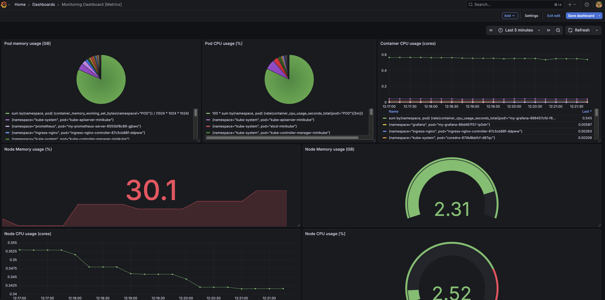
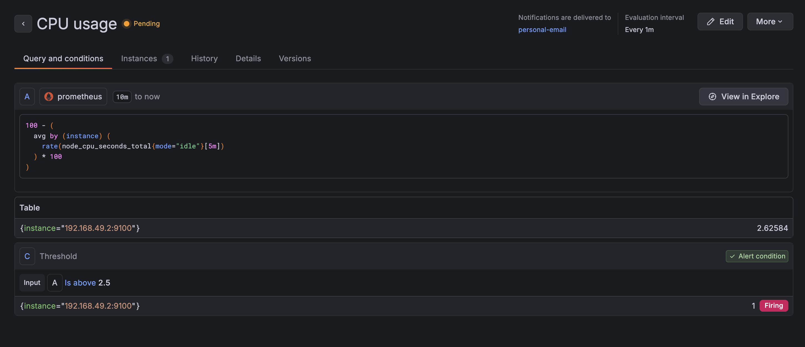
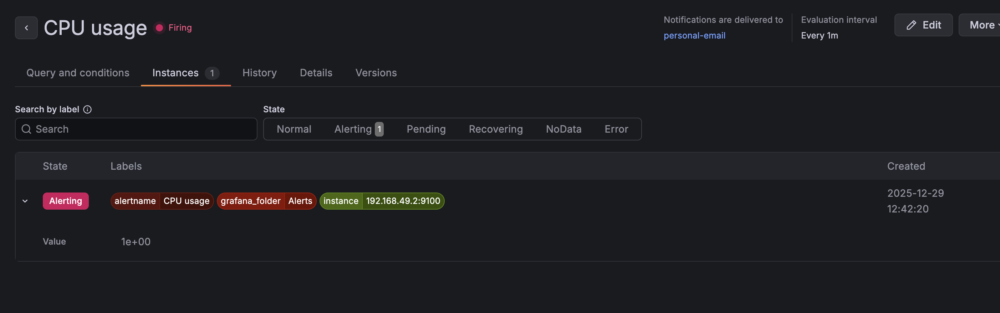

# Section 1: Conceptual Understanding (20 pts)

### 1. Explain the key differences between proactive and reactive monitoring. (5 pts)

Proactive monitoring involves identifying and addressing potential issues before they impact users. It relies on collecting data to spot trends and anomalies (e.g., constantly growing memory usage that could indicate a memory leak), aiming to prevent outages. In contrast, reactive monitoring involves responding to failures after they have already occurred and been detected. While proactive monitoring reduces downtime and improves performance, reactive monitoring is triggered by alerts when a system is already failing.

### 2. What are MTTD and MTTR? Why are they important? (5 pts)

**MTTD (Mean Time to Detect)** is the average time it takes to discover that an incident is occurring. A low MTTD is crucial because it indicates that a monitoring system is effective at catching issues before they escalate or affect customers. A high MTTD suggests "blind spots" where problems go unnoticed until reported by users.

**MTTR (Mean Time to Recover)** is the average time it takes to resolve an issue and restore service after it has been detected. A low MTTR reflects a well-prepared team with efficient debugging processes, good documentation, and automation. A high MTTR may point to an overly complex system, an under-trained team, or a slow deployment process for fixes.

Both metrics are vital from a business perspective, as they directly impact service availability and adherence to Service Level Agreements (SLAs). Minimizing both MTTD and MTTR reduces downtime, which in turn prevents financial penalties and protects customer trust.

### 3. Describe a typical incident lifecycle and the role of DevOps in each stage. (5 pts)

A typical incident lifecycle consists of the following stages:
-   **Detection**: An issue is identified, either through automated monitoring alerts (proactive) or user reports (reactive). DevOps engineers are responsible for building and maintaining the monitoring systems that enable early detection.
-   **Response**: The on-call team acknowledges the incident and begins the initial investigation to assess the impact. DevOps practices ensure that the right people are notified quickly through automated alerting and escalation policies.
-   **Resolution**: Engineers work to find the root cause and apply a fix to restore the service. DevOps emphasizes collaboration and having the right tools for quick debugging and deployment, allowing teams to ship a hotfix rapidly.
-   **Post-Incident (Postmortem)**: After the incident is resolved, the team conducts a blameless postmortem to understand what went wrong and identify preventative measures for the future. DevOps culture encourages this learning process to continuously improve system reliability and team response.

### 4. List three external monitoring platforms and their advantages. (5 pts)

- **Datadog**: Provides a unified "single pane of glass" for metrics, logs, and APM, making it easy to correlate data across an entire stack. It is known for its ease of use and scalability.
- **New Relic**: Offers a strong focus on Application Performance Monitoring (APM), providing deep insights into application behavior and user experience.
- **Dynatrace**: Utilizes an AI engine (Davis) for powerful, automatic root-cause analysis and anomaly detection, reducing the manual effort required to diagnose problems.

# Section 2: Monitoring Tools Exploration (20 pts)

### 1. What is Prometheus used for in monitoring? (5 pts)

Prometheus is an open-source monitoring system and time-series database. It is primarily used for collecting and storing metrics by "scraping" them from specified targets over HTTP. Designed for reliability and scalability, it has become the industry standard for monitoring in Kubernetes environments.

### 2. Describe how Grafana complements Prometheus. (5 pts)

Grafana acts as the visualization layer for Prometheus. While Prometheus is responsible for storing data and enabling powerful queries with its language (PromQL), its own graphing capabilities are basic. Grafana connects to Prometheus as a data source to build rich, interactive, and real-time dashboards, allowing users to visualize metrics and create beautiful charts and alerts.

### 3. What data does Node Exporter collect? Name three example metrics. (5 pts)

Node Exporter is an agent that runs on Unix-like hosts to expose a wide range of hardware and OS-level metrics.

Examples:
-   `node_cpu_seconds_total`: Tracks the total amount of time the CPU has spent in various modes (e.g., user, system, idle).
-   `node_memory_MemAvailable_bytes`: Shows the amount of available memory on the host.
-   `node_filesystem_avail_bytes`: Reports the available disk space on filesystems.

### 4. What is PagerDuty and how does it integrate with monitoring tools? (5 pts)

PagerDuty is an incident management and on-call automation platform. It integrates with monitoring tools like Prometheus (via Alertmanager) or Datadog by receiving alerts through API calls or webhooks. When a monitoring tool detects a problem and sends a "firing" alert, PagerDuty automatically routes it to the correct on-call engineer using predefined schedules and escalation policies, ensuring that critical alerts are never missed.

# Section 3: Monitoring with Prometheus and Grafana on Kubernetes

This guide details how to set up a monitoring stack on a local Kubernetes cluster using Minikube. The stack includes Prometheus for metrics collection and Grafana for visualization.

## Overview

The main objectives of this setup are:
- Create a local Kubernetes cluster using Minikube.
- Install Prometheus and Grafana using Helm charts.
- Expose the services using `kubectl port-forward` to access them in a web browser.
- Scrape metrics from Kubernetes nodes using **Node Exporter** and container metrics using **cAdvisor**.

## Prerequisites

Before you begin, ensure you have the following tools installed:
- [Docker](https://docs.docker.com/get-docker/)
- [Minikube](https://minikube.sigs.k8s.io/docs/start/)
- [Helm](https://helm.sh/docs/intro/install/)

---

## Installation Steps

### 1. Install Prometheus

First, we'll create a dedicated namespace and install Prometheus using the official Helm chart.

```bash
# Create a namespace for Prometheus
kubectl create namespace prometheus

# Install Prometheus from the community Helm repository
helm install my-prometheus oci://ghcr.io/prometheus-community/charts/prometheus -n prometheus -f Prometheus/values.yaml
```

### 2. Install Grafana

Next, we'll set up Grafana in its own namespace.

```bash
# Create a namespace for Grafana
kubectl create namespace grafana

# Add the Grafana Helm repository
helm repo add grafana https://grafana.github.io/helm-charts
helm repo update

# Install Grafana using the Helm chart
helm install my-grafana grafana/grafana -n grafana -f Grafana/values.yaml
```

---

## Accessing the Services

To access the Prometheus and Grafana dashboards, you'll need to forward their ports to your local machine.

### Accessing Prometheus

The Prometheus server can be accessed on port `9090`.

```bash
# Get the Prometheus pod name
export PROMETHEUS_POD_NAME=$(kubectl get pods --namespace prometheus -l "app.kubernetes.io/name=prometheus,app.kubernetes.io/instance=my-prometheus" -o jsonpath="{.items[0].metadata.name}")

# Port-forward to your local machine
kubectl --namespace prometheus port-forward $PROMETHEUS_POD_NAME 9090
```
You can now access the Prometheus UI at `http://localhost:9090`.

### Accessing Grafana

The Grafana server can be accessed on port `3000`.

1.  **Get the Admin Password:**
    ```bash
    kubectl get secret --namespace grafana my-grafana -o jsonpath="{.data.admin-password}" | base64 --decode ; echo
    ```

2.  **Port-Forward the Service:**
    ```bash
    # Get the Grafana pod name
    export GRAFANA_POD_NAME=$(kubectl get pods --namespace grafana -l "app.kubernetes.io/name=grafana,app.kubernetes.io/instance=my-grafana" -o jsonpath="{.items[0].metadata.name}")
    
    # Port-forward to your local machine
    kubectl --namespace grafana port-forward $GRAFANA_POD_NAME 3000
    ```

3.  **Log In:**
    Open `http://localhost:3000` in your browser. Log in with the username `admin` and the password retrieved in the first step.

---

## Configuration Details

### Grafana Data Source

To connect Grafana to Prometheus, set the data source URL to `http://my-prometheus-server.prometheus.svc.cluster.local`. This internal service name is accessible because both applications are running within the same Kubernetes cluster.

### Prometheus Scrape Configurations

Prometheus is configured via the `Prometheus/values.yaml` file to scrape metrics from various targets.

#### Node Exporter

Node Exporter is enabled in the `values.yaml` file to collect hardware and OS metrics from the Kubernetes nodes.
```yaml
prometheus-node-exporter:
  enabled: true
```
The scrape configuration for the endpoints is defined as follows:
```yaml
- job_name: 'kubernetes-service-endpoints'
  honor_labels: true
  kubernetes_sd_configs:
    - role: endpoints
  relabel_configs:
    - source_labels: [__meta_kubernetes_service_annotation_prometheus_io_scrape]
      action: keep
      regex: true
    # ... other relabeling rules
```


#### cAdvisor

cAdvisor (Container Advisor) comes built-in with Kubelet and exposes container metrics. Prometheus is configured to scrape these metrics with the following job:
```yaml
- job_name: 'kubernetes-nodes-cadvisor'
  scheme: https
  kubernetes_sd_configs:
    - role: node
  relabel_configs:
    - target_label: __address__
      replacement: kubernetes.default.svc:443
    - source_labels: [__meta_kubernetes_node_name]
      target_label: __metrics_path__
      replacement: /api/v1/nodes/$1/proxy/metrics/cadvisor
```


#### Grafana Metrics

To allow Prometheus to scrape Grafana's internal metrics, the following annotations were added to the Grafana service in its `values.yaml`:
```yaml
annotations:
  prometheus.io/scrape: "true"
  prometheus.io/port: "3000"
  prometheus.io/path: "/metrics"
```

## Grafana Dashboard



## Alert




---
