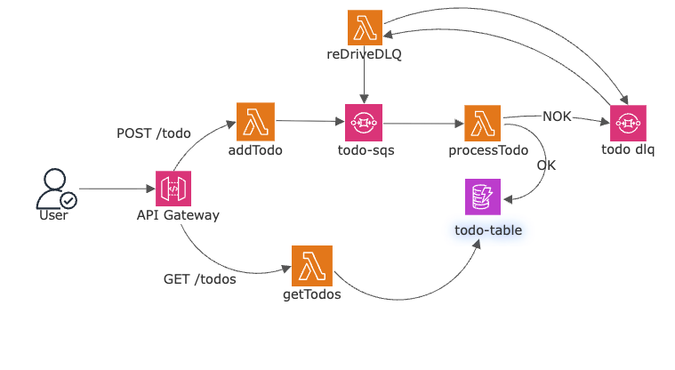
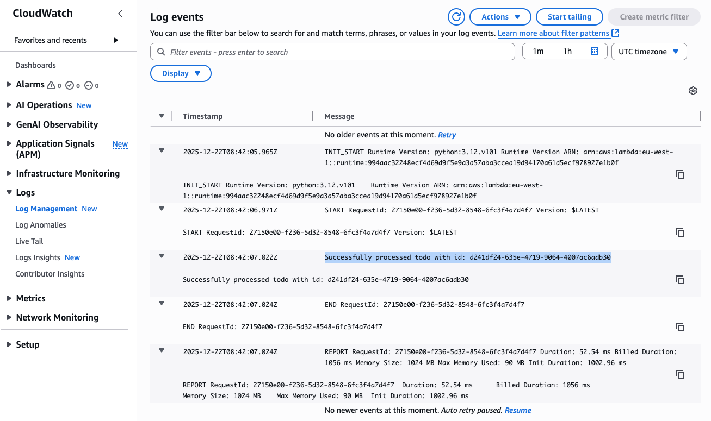
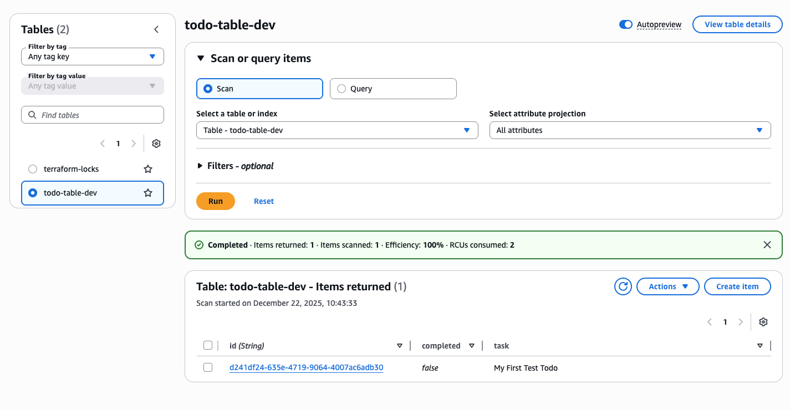
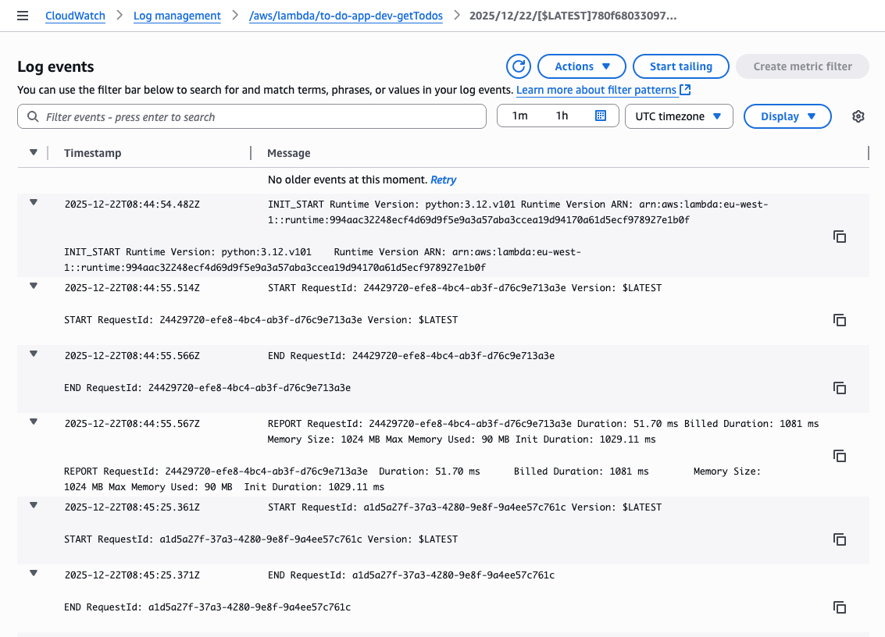

# To-Do List Serverless Application

This project is a serverless to-do list application built with the Serverless Framework on AWS. It demonstrates a secure, scalable, and resilient architecture using asynchronous processing with SQS and private networking within a VPC.

## Table of Contents

- [Architecture](#architecture)
  - [Overview](#overview)
  - [Visual Diagram](#visual-diagram)
  - [Application Flow](#application-flow)
- [AWS Resources](#aws-resources)
  - [Lambda Functions](#lambda-functions)
  - [IAM Roles & Permissions](#iam-roles--permissions)
  - [Networking](#networking)
- [Deployment](#deployment)
- [Testing](#testing)
  - [Scenario 1: Happy Path](#scenario-1-happy-path-creating-and-retrieving-a-to-do)
  - [Scenario 2: Error Handling](#scenario-2-error-handling--dlq-testing)
- [Cleanup](#cleanup)

## Architecture

### Overview

The application is designed around an asynchronous, event-driven architecture to decouple the API from the backend processing. When a new to-do is created, it's not written directly to the database. Instead, it's sent as a message to an SQS queue. A separate Lambda function then processes messages from this queue, providing resilience and scalability.

All resources are deployed within a custom VPC. The Lambda functions run in private subnets with no direct internet access, enhancing security. They communicate with other AWS services (SQS, DynamoDB) privately and securely using VPC Endpoints.

**Core Technologies:**
- **Compute:** AWS Lambda
- **API:** Amazon API Gateway (HTTP API)
- **Database:** Amazon DynamoDB
- **Queueing:** Amazon SQS (Standard Queue & Dead-Letter Queue)
- **Networking:** Amazon VPC, Private Subnets, VPC Endpoints
- **Framework:** Serverless Framework

### Visual Diagram



### Application Flow

1.  **Create To-Do (POST `/todo`):**
    *   A client sends a `POST` request to the `/todo` endpoint on **API Gateway**.
    *   API Gateway triggers the `addTodo` Lambda function.
    *   The `addTodo` function's sole responsibility is to validate the input and send it as a message to the **`TodoQueue`** (SQS). This makes the API endpoint extremely fast and responsive.

2.  **Process To-Do (SQS Trigger):**
    *   The message in the `TodoQueue` automatically triggers the `processTodo` Lambda function.
    *   This function reads the message and writes the task details into the **`TodoTable`** (DynamoDB).

3.  **Get To-Dos (GET `/todos`):**
    *   A client sends a `GET` request to the `/todos` endpoint.
    *   API Gateway triggers the `getTodos` Lambda function, which queries the `TodoTable` and returns all to-do items.

4.  **Error Handling (`TodoDLQ`):**
    *   If the `processTodo` function fails to process a message (e.g., due to a bug or bad data), SQS will retry. After 3 failed attempts, the message is automatically moved to the **`TodoDLQ`** (a Dead-Letter Queue). This prevents a single bad message from blocking the entire queue.

5.  **DLQ Re-Drive:**
    *   The `reDriveDLQ` function can be manually triggered by a developer to move messages from the `TodoDLQ` back to the main `TodoQueue` for reprocessing after a bug fix has been deployed.

## AWS Resources

### Lambda Functions

- **`addTodo`**
  - **Trigger:** API Gateway (`POST /todo`)
  - **Purpose:** Receives new to-do tasks from the client. Its only job is to put the task into the `TodoQueue` for asynchronous processing.

- **`getTodos`**
  - **Trigger:** API Gateway (`GET /todos`)
  - **Purpose:** Fetches all to-do items from the `TodoTable` in DynamoDB and returns them to the client.

- **`processTodo`**
  - **Trigger:** SQS (`TodoQueue`)
  - **Purpose:** The background worker. It's triggered by new messages in the SQS queue. It takes the task from the message and saves it to the DynamoDB table.

- **`reDriveDLQ`**
  - **Trigger:** Manual Invocation
  - **Purpose:** An operational utility function. It moves failed messages from the `TodoDLQ` back to the main `TodoQueue` so they can be processed again.

### IAM Roles & Permissions

A single IAM role is created and shared by all Lambda functions in this service. Following the principle of least privilege, this role only grants the permissions necessary for the functions to perform their duties.

- **`dynamodb:*` on `TodoTable`**
  - **Why:** Allows the `getTodos` and `processTodo` functions to read from and write to the DynamoDB table where tasks are stored.
- **`sqs:*` on `TodoQueue` and `TodoDLQ`**
  - **Why:** Allows the `addTodo` function to send messages, `processTodo` to receive/delete messages, and `reDriveDLQ` to move messages between the queues.
- **`ec2:CreateNetworkInterface`, `ec2:DescribeNetworkInterfaces`, `ec2:DeleteNetworkInterface` on `*`**
  - **Why:** These permissions are required for the Lambda service to create and manage Elastic Network Interfaces (ENIs) within your VPC. This is how a Lambda function connects to a private subnet to access other VPC resources like your endpoints.

### Networking

The entire application stack is deployed inside a custom VPC for security and isolation.
- **VPC & Private Subnets:** Two private subnets are used across two Availability Zones for high availability. The Lambda functions are placed here, meaning they cannot be accessed from the public internet directly.
- **VPC Endpoints:** To allow the functions to communicate with AWS services without traversing the internet, VPC Endpoints are used:
  - **Gateway Endpoint for DynamoDB:** Provides a secure and private connection to DynamoDB.
  - **Interface Endpoint for SQS:** Provides a secure and private connection to SQS.

## Deployment

To deploy the service, you need the Serverless Framework installed and your AWS credentials configured.

```bash
# Install dependencies (if any)
npm install

# Deploy the stack to AWS
serverless deploy --stage <stage_name>
```
After deployment, the CLI will output your API Gateway endpoints.

## Testing

You will need your API Gateway URL from the deployment output to run these tests.

### Scenario 1: Happy Path (Creating and Retrieving a To-Do)

This test validates the main application flow.

**1. Create a new To-Do item**

Run the following `curl` command to send a `POST` request to your `/todo` endpoint.

```bash
curl -v -X POST "YOUR_API_GATEWAY_URL/todo" \
-H "Content-Type: application/json" \
-d '{"task": "Buy milk and bread"}'
```
**Expected Outcome:** You should receive a `200 OK` response.

**2. Verify Background Processing**

- **Check CloudWatch Logs for `processTodo`:**
  - Go to the AWS Console: `CloudWatch` -> `Log Groups`.
  - Find the log group for `/aws/lambda/to-do-app-dev-processTodo`.
  - You should see a new log stream indicating a successful execution.



- **Check DynamoDB:**
  - Go to the AWS Console: `DynamoDB` -> `Tables` -> `todo-table-dev`.
  - Click "Explore table items".
  - You should see the new item `"task": "Buy milk and bread"`.



**3. Retrieve all To-Do items**

Run the following `curl` command to `GET` all items.

```bash
curl -v -X GET "YOUR_API_GATEWAY_URL/todos"
```
**Expected Outcome:** You should get a `200 OK` response with a JSON body containing a list of your to-do items.



### Scenario 2: Error Handling & DLQ Testing

This test validates that failed messages are correctly sent to the Dead-Letter Queue.

**1. Simulate a Processing Error**

To test the DLQ, we need to make the `processTodo` function fail.
- **Edit the code:** Open `src/processTodo.py`.
- **Introduce an error:** At the beginning of the `handler` function, add a line that will cause an exception, for example: `raise ValueError("Simulating a processing error!")`
- **Redeploy the function:** `serverless deploy function -f processTodo`

**2. Send a bad Message**

Send another request just like in the happy path test.

```bash
curl -v -X POST "YOUR_API_GATEWAY_URL/todo" \
-H "Content-Type: application/json" \
-d '{"task": "This task will fail"}'
```
**3. Verify the DLQ**

- **Check CloudWatch Logs for `processTodo`:** You will see logs showing the function failed 3 times with the error "Simulating a processing error!".

  <br>
  *PASTE YOUR FAILED `processTodo` LOG SCREENSHOT HERE*
  <br>

- **Check the Dead-Letter Queue:**
  - Go to the AWS Console: `SQS` -> `Queues`.
  - Find `todo-dlq-dev`.
  - Under "Messages available", you should see `1`. You can click "Send and receive messages" to view the message content.

  <br>
  *PASTE YOUR SQS DLQ SCREENSHOT HERE*
  <br>

**4. Trigger the Re-Drive Function (Optional)**

- **Important:** First, fix the error in `src/processTodo.py` by removing the `raise ValueError(...)` line and redeploying: `serverless deploy function -f processTodo`.
- Manually invoke the `reDriveDLQ` function from the AWS Console or using the Serverless Framework CLI:
  ```bash
  serverless invoke -f reDriveDLQ
  ```
- **Verify:** The message count in `todo-dlq-dev` should go to 0, and you should see a new successful execution log for `processTodo` and a new item in your DynamoDB table.

## Cleanup

To remove all the deployed resources from your AWS account, run the following command:

```bash
serverless remove
```
