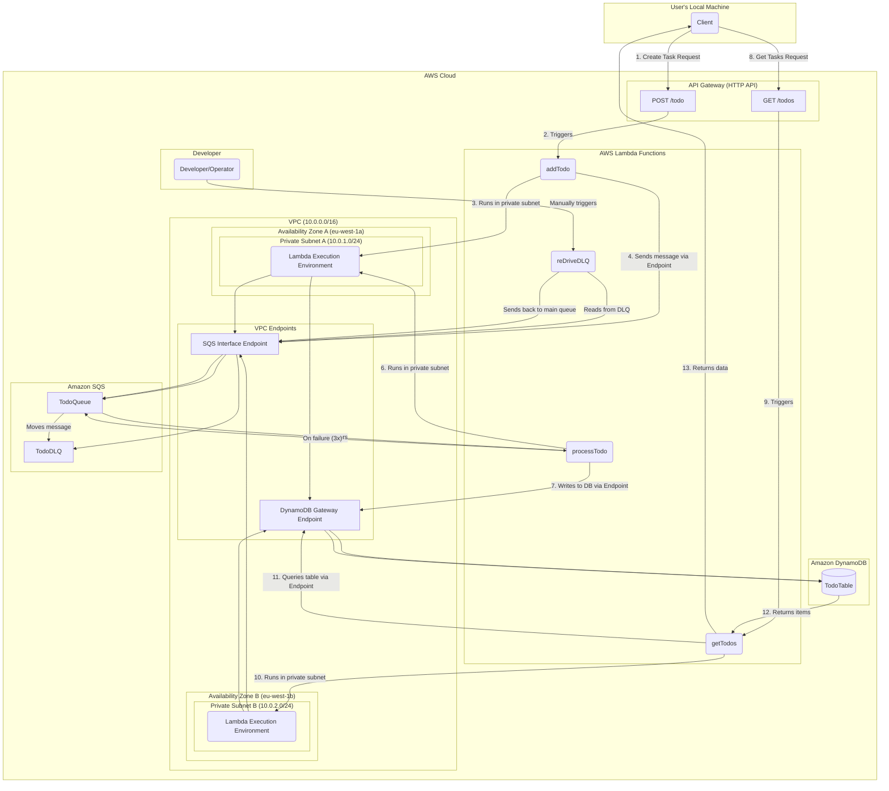

<!--
title: 'AWS Simple HTTP Endpoint example in Python'
description: 'This template demonstrates how to make a simple HTTP API with Python running on AWS Lambda and API Gateway using the Serverless Framework.'
layout: Doc
framework: v4
platform: AWS
language: python
authorLink: 'https://github.com/serverless'
authorName: 'Serverless, Inc.'
authorAvatar: 'https://avatars1.githubusercontent.com/u/13742415?s=200&v=4'
-->

# Serverless Framework Python HTTP API on AWS

This template demonstrates how to make a simple HTTP API with Python running on AWS Lambda and API Gateway using the Serverless Framework.

This template does not include any kind of persistence (database). For more advanced examples, check out the [serverless/examples repository](https://github.com/serverless/examples/) which includes DynamoDB, Mongo, Fauna and other examples.

## Usage

### Deployment

```
serverless deploy
```

After deploying, you should see output similar to:

```
Deploying "aws-python-http-api" to stage "dev" (us-east-1)

✔ Service deployed to stack aws-python-http-api-dev (85s)

endpoint: GET - https://6ewcye3q4d.execute-api.us-east-1.amazonaws.com/
functions:
  hello: aws-python-http-api-dev-hello (2.3 kB)
```

_Note_: In current form, after deployment, your API is public and can be invoked by anyone. For production deployments, you might want to configure an authorizer. For details on how to do that, refer to [http event docs](https://www.serverless.com/framework/docs/providers/aws/events/apigateway/).

### Invocation

After successful deployment, you can call the created application via HTTP:

```
curl https://xxxxxxx.execute-api.us-east-1.amazonaws.com/
```

Which should result in response similar to the following (removed `input` content for brevity):

```json
{
  "message": "Go Serverless v4.0! Your function executed successfully!"
}
```

### Local development

You can invoke your function locally by using the following command:

```
serverless invoke local --function hello
```

Which should result in response similar to the following:

```json
{
  "statusCode": 200,
  "body": "{\n  \"message\": \"Go Serverless v4.0! Your function executed successfully!\"}"
}
```

Alternatively, it is also possible to emulate API Gateway and Lambda locally by using `serverless-offline` plugin. In order to do that, execute the following command:

```
serverless plugin install -n serverless-offline
```

It will add the `serverless-offline` plugin to `devDependencies` in `package.json` file as well as will add it to `plugins` in `serverless.yml`.

After installation, you can start local emulation with:

```
serverless offline
```

To learn more about the capabilities of `serverless-offline`, please refer to its [GitHub repository](https://github.com/dherault/serverless-offline).

### Bundling dependencies

In case you would like to include 3rd party dependencies, you will need to use a plugin called `serverless-python-requirements`. You can set it up by running the following command:

```
serverless plugin install -n serverless-python-requirements
```

Running the above will automatically add `serverless-python-requirements` to `plugins` section in your `serverless.yml` file and add it as a `devDependency` to `package.json` file. The `package.json` file will be automatically created if it doesn't exist beforehand. Now you will be able to add your dependencies to `requirements.txt` file (`Pipfile` and `pyproject.toml` is also supported but requires additional configuration) and they will be automatically injected to Lambda package during build process. For more details about the plugin's configuration, please refer to [official documentation](https://github.com/UnitedIncome/serverless-python-requirements).


